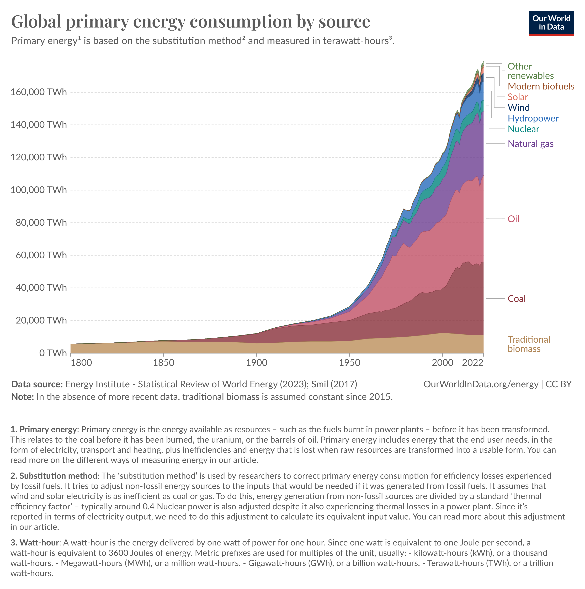

# Global Energy Consumption

**Data (data.world):** [https://data.world/makeovermonday/global-energy-consumption](https://data.world/makeovermonday/global-energy-consumption)

**Article / original viz:** [https://ourworldindata.org/energy-production-consumption#how-much-energy-does-the-world-consume](https://ourworldindata.org/energy-production-consumption#how-much-energy-does-the-world-consume)

**Original data source:** [https://ourworldindata.org/energy-production-consumption#how-much-energy-does-the-world-consume](https://ourworldindata.org/energy-production-consumption#how-much-energy-does-the-world-consume)

**Dataset:** `makeovermonday/global-energy-consumption`  
**Last updated on data.world:** 2024-05-05T19:19:54.739322385Z

---

How much energy does the world consume?

---
{"editor":"simple"}
---
# **Original Visualization**

​

Article and Datasource : [Energy Production and Consumption - Our World in Data](https://ourworldindata.org/energy-production-consumption#how-much-energy-does-the-world-consume)