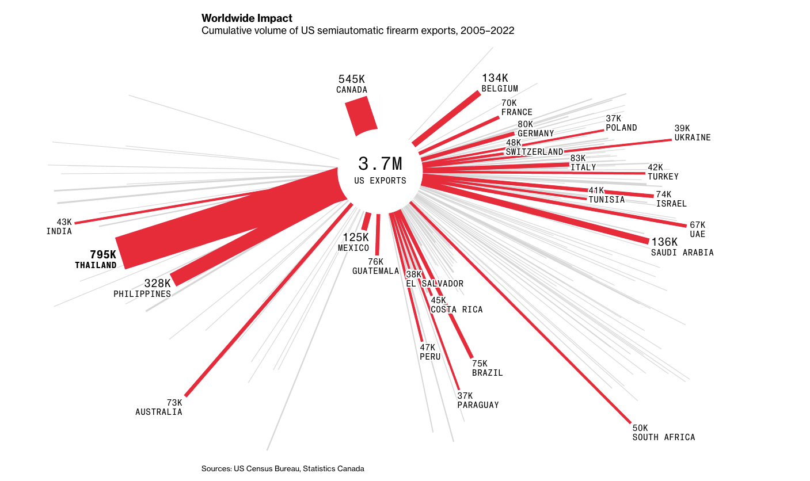

# 2024/W20 US-Made Gun Exports 2005-2022

**Data (data.world):** [https://data.world/makeovermonday/2024w20-us-made-gun-exports-2005-2022](https://data.world/makeovermonday/2024w20-us-made-gun-exports-2005-2022)

**Article / original viz:** [https://www.bloomberg.com/graphics/2023-us-made-gun-exports-shootings-violence-sig-sauer/](https://www.bloomberg.com/graphics/2023-us-made-gun-exports-shootings-violence-sig-sauer/)

**Original data source:** [https://www.census.gov/foreign-trade/data/index.html](https://www.census.gov/foreign-trade/data/index.html)

**Dataset:** `makeovermonday/2024w20-us-made-gun-exports-2005-2022`  
**Last updated on data.world:** 2024-05-12T14:08:57.506328023Z

---

Cumulative volume of US semiautomatic firearm exports, 2005–2022

---
{"editor":"simple"}
---
# **Original Visualization**

​

Datasource : [United States Census Bureau](https://www.census.gov/foreign-trade/data/index.html)

Article : [Bloomberg](https://www.bloomberg.com/graphics/2023-us-made-gun-exports-shootings-violence-sig-sauer/)