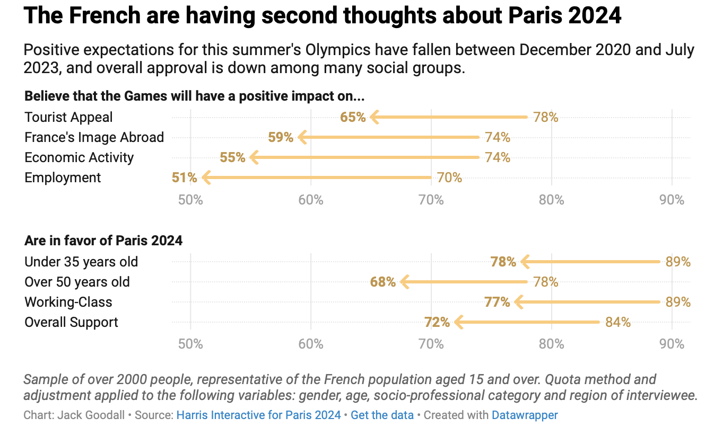

# 2024/W21: French people are losing confidence in the Paris

**Data (data.world):** [https://data.world/makeovermonday/2024w20-french-people-are-losing-confidence-in-the-paris](https://data.world/makeovermonday/2024w20-french-people-are-losing-confidence-in-the-paris)

**Article / original viz:** [https://blog.datawrapper.de/public-confidence-paris-olympics/](https://blog.datawrapper.de/public-confidence-paris-olympics/)

**Original data source:** [https://harris-interactive.fr/opinion_polls/barometre-du-rapport-des-francais-aux-jeux-olympiques-et-paralympiques-de-paris-2024-vague-5/](https://harris-interactive.fr/opinion_polls/barometre-du-rapport-des-francais-aux-jeux-olympiques-et-paralympiques-de-paris-2024-vague-5/)

**Dataset:** `makeovermonday/2024w20-french-people-are-losing-confidence-in-the-paris`  
**Last updated on data.world:** 2024-05-20T10:29:56.738207792Z

---

---
{"editor":"simple"}
---
French people are losing confidence in the Paris Olympics

Article : https://blog.datawrapper.de/public-confidence-paris-olympics/

Source: [Harris Interactive for Paris 2024](https://harris-interactive.fr/opinion_polls/barometre-du-rapport-des-francais-aux-jeux-olympiques-et-paralympiques-de-paris-2024-vague-5/)

​

