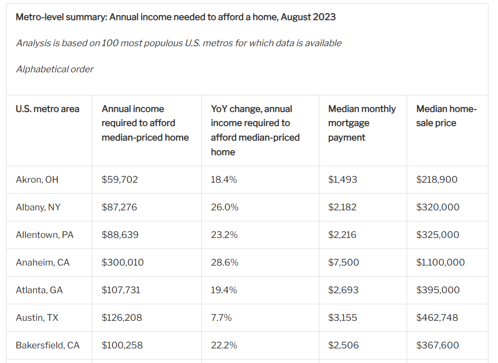
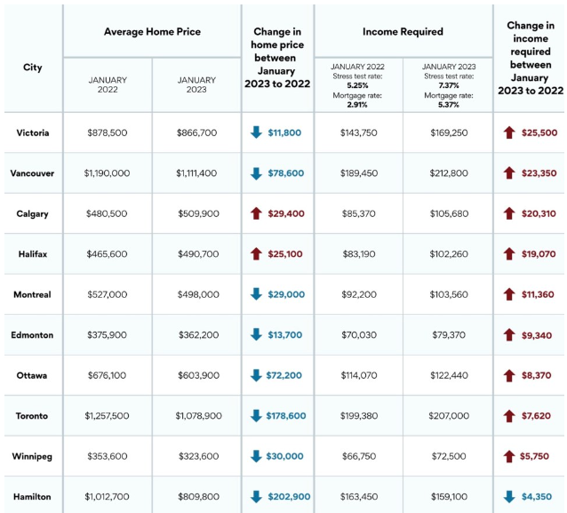

# US Home Affordability

**Data (data.world):** [https://data.world/makeovermonday/us-home-affordability](https://data.world/makeovermonday/us-home-affordability)

**Article / original viz:** [https://www.redfin.com/news/homebuyer-income-afford-home-record-high/](https://www.redfin.com/news/homebuyer-income-afford-home-record-high/)

**Original data source:** [https://www.redfin.com/news/homebuyer-income-afford-home-record-high/](https://www.redfin.com/news/homebuyer-income-afford-home-record-high/)

**Dataset:** `makeovermonday/us-home-affordability`  
**Last updated on data.world:** 2024-05-26T22:21:36.467958463Z

---

Metro-level summary: Annual income needed to afford a home, August 2023

---
{"editor":"simple"}
---
# **Original Visualization**
US Version

​

Canadian Version

​

US Article and Datasource : [A Homebuyer Needs to Earn $115,000 to Afford the Typical U.S. Home, More Than Ever Before (redfin.com)](https://www.redfin.com/news/homebuyer-income-afford-home-record-high/)

Canadian Article and Datasource: [You won't believe how much income you now need to afford a home in Canada](https://www.newmarkettoday.ca/village-life/you-wont-believe-how-much-income-you-now-need-to-afford-a-home-in-canada-6654848)