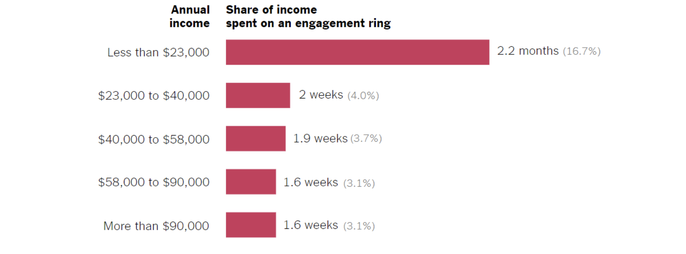

# 2024/W24 Engagement Ring Costs

**Data (data.world):** [https://data.world/makeovermonday/w242024-whats-going-on-in-this-graph-engagement-ring-c](https://data.world/makeovermonday/w242024-whats-going-on-in-this-graph-engagement-ring-c)

**Article / original viz:** [https://www.nytimes.com/2020/02/06/learning/whats-going-on-in-this-graph-engagement-ring-costs.html](https://www.nytimes.com/2020/02/06/learning/whats-going-on-in-this-graph-engagement-ring-costs.html)

**Original data source:** [https://www.nytimes.com/2020/02/06/learning/whats-going-on-in-this-graph-engagement-ring-costs.html](https://www.nytimes.com/2020/02/06/learning/whats-going-on-in-this-graph-engagement-ring-costs.html)

**Dataset:** `makeovermonday/w242024-whats-going-on-in-this-graph-engagement-ring-c`  
**Last updated on data.world:** 2024-06-09T18:37:27.582055037Z

---

---
{"editor":"simple"}
---
How much do people spend on engagement rings?

​

Link to article :[https://www.nytimes.com/2020/02/06/learning/whats-going-on-in-this-graph-engagement-ring-costs.html](https://www.nytimes.com/2020/02/06/learning/whats-going-on-in-this-graph-engagement-ring-costs.html)

Source: National poll of 1,640 adults between Jan. 24 – 30, 2019 by Morning Consult

​