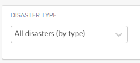
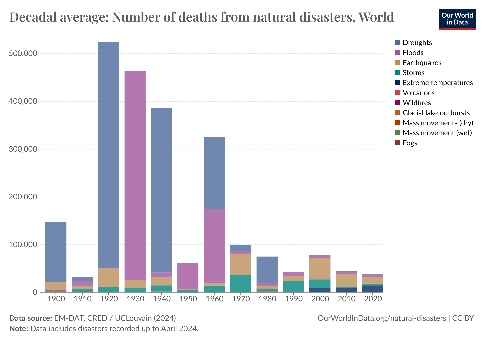

# Death from Natural Disasters

**Data (data.world):** [https://data.world/makeovermonday/a-century-of-global-deaths-from-disasters](https://data.world/makeovermonday/a-century-of-global-deaths-from-disasters)

**Article / original viz:** [https://ourworldindata.org/natural-disasters](https://ourworldindata.org/natural-disasters)

**Original data source:** [https://ourworldindata.org/natural-disasters](https://ourworldindata.org/natural-disasters)

**Dataset:** `makeovermonday/a-century-of-global-deaths-from-disasters`  
**Last updated on data.world:** 2024-06-16T21:48:07.121663267Z

---

How many people die from disasters, and how are these impacts changing over time?

---
{"editor":"simple"}
---
# **Original Visualization**
\*To view the exact chart on the article page, change the "Disaster Type" selection in the dropdown

​

Link to article :[Natural Disasters - Our World in Data](https://ourworldindata.org/natural-disasters)

Source: [Natural Disasters - Our World in Data](https://ourworldindata.org/natural-disasters)

Notes on data: Decadal figures are measured as the annual average over the subsequent ten-year period. This means figures for ‘1900’ represent the average from1900 to 1909; ‘1910’ is the average from 1910 to 1919 etc. Data includes disasters recorded up to April 2024.