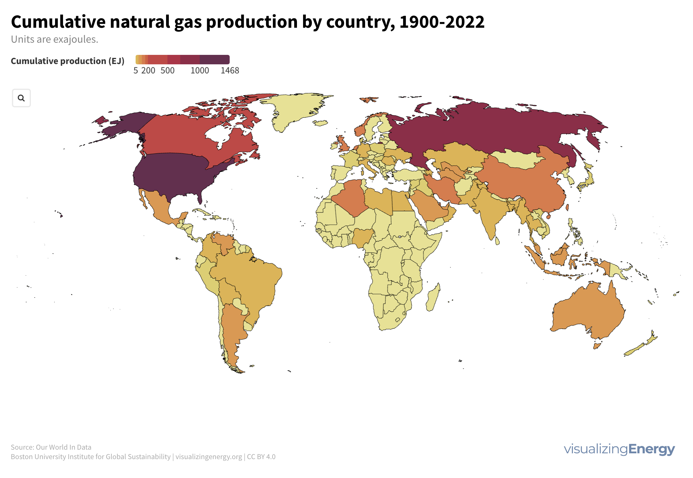
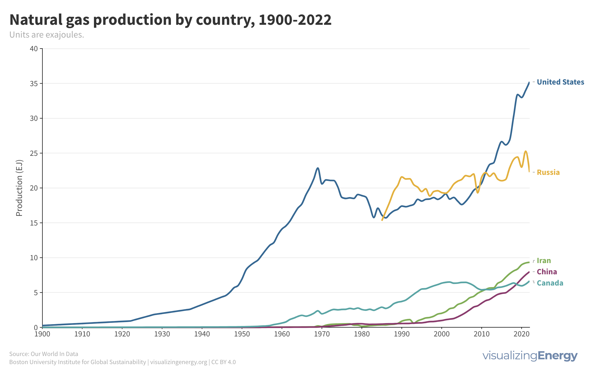

# Week 27 / The history of global natural gas production

**Data (data.world):** [https://data.world/makeovermonday/week-27-what-to-watch-in-2024-energy](https://data.world/makeovermonday/week-27-what-to-watch-in-2024-energy)

**Article / original viz:** [https://visualizingenergy.org/the-history-of-global-natural-gas-production/](https://visualizingenergy.org/the-history-of-global-natural-gas-production/)

**Original data source:** [https://visualizingenergy.org/the-history-of-global-natural-gas-production/](https://visualizingenergy.org/the-history-of-global-natural-gas-production/)

**Dataset:** `makeovermonday/week-27-what-to-watch-in-2024-energy`  
**Last updated on data.world:** 2024-06-30T19:05:29.270322731Z

---

The history of global natural gas production

---
{"editor":"simple"}
---
article: [https://visualizingenergy.org/the-history-of-global-natural-gas-produ](https://visualizingenergy.org/the-history-of-global-natural-gas-production/)

**Objectives**

* What works and what doesn't work with this chart?
* How can you make it better?
* Post your alternative on the discussions page.
​
​

