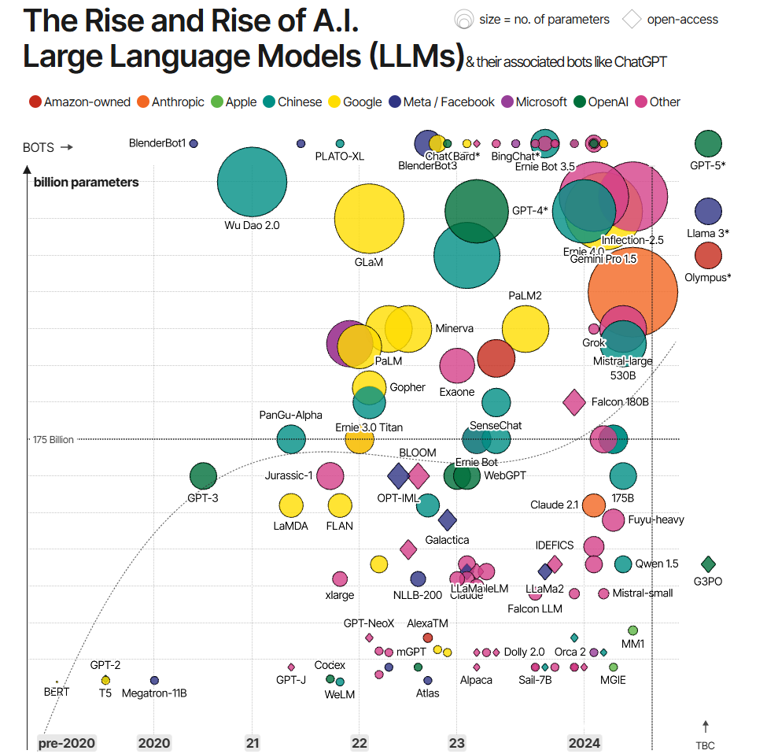

# The Rise and Rise of LLMs

**Data (data.world):** [https://data.world/makeovermonday/the-rise-and-rise-of-llms](https://data.world/makeovermonday/the-rise-and-rise-of-llms)

**Article / original viz:** [https://informationisbeautiful.net/visualizations/the-rise-of-generative-ai-large-language-models-llms-like-chatgpt/](https://informationisbeautiful.net/visualizations/the-rise-of-generative-ai-large-language-models-llms-like-chatgpt/)

**Original data source:** [https://geni.us/IIB-LLMdata](https://geni.us/IIB-LLMdata)

**Dataset:** `makeovermonday/the-rise-and-rise-of-llms`  
**Last updated on data.world:** 2024-07-07T21:33:37.580032200Z

---

The Rise and Rise of A.I.   Large Language Models (LLMs)& their associated bots like ChatGPT

---
{"editor":"simple"}
---
# **Original Visualization**
​

​

Link to original :  [The Rise of Generative AI Large Language Models (LLMs) like ChatGPT — Information is Beautiful](https://informationisbeautiful.net/visualizations/the-rise-of-generative-ai-large-language-models-llms-like-chatgpt/)

Source : [https://geni.us/IIB-LLMdata](https://geni.us/IIB-LLMdata)