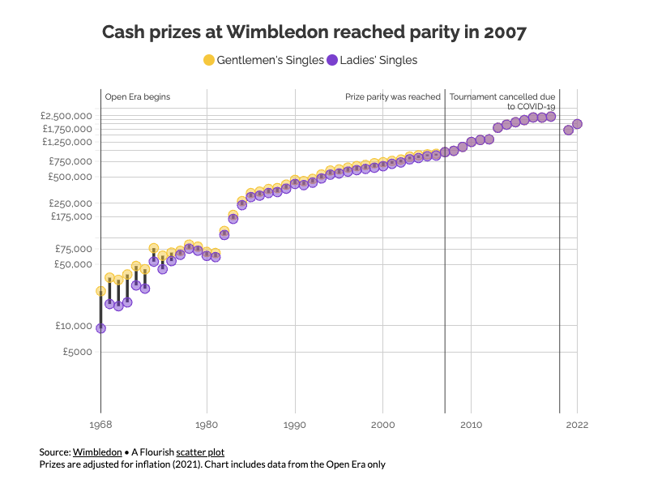
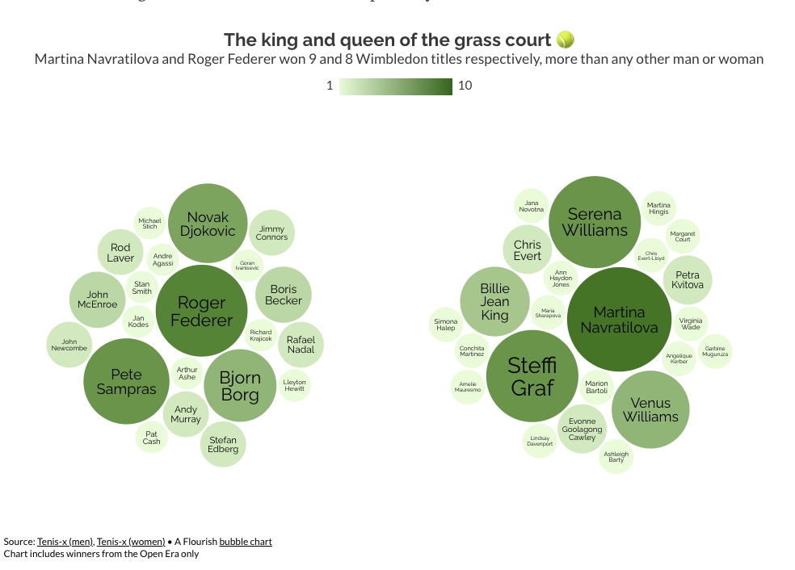

# 2024/W29 Open Era Wimbledon Championships

**Data (data.world):** [https://data.world/makeovermonday/2024w29-open-era-wimbledon-championships](https://data.world/makeovermonday/2024w29-open-era-wimbledon-championships)

**Article / original viz:** [https://flourish.studio/blog/visualizing-wimbledon-2022/](https://flourish.studio/blog/visualizing-wimbledon-2022/)

**Original data source:** [https://www.wimbledon.com/en_GB/draws_archive/champions/gentlemenssingles.html](https://www.wimbledon.com/en_GB/draws_archive/champions/gentlemenssingles.html)

**Dataset:** `makeovermonday/2024w29-open-era-wimbledon-championships`  
**Last updated on data.world:** 2024-07-14T16:01:42.114860089Z

---

Open Era (1968 Onwards) Wimbledon Championships & Prize Money (£)

---
{"editor":"simple"}
---
# **Original Visualizations**
​

​

Datasource : [Wimbledon (Prize Money)](https://www.wimbledon.com/en_GB/about_wimbledon/prize_money_and_finance.html), [Wimbledon (Champions)](https://www.wimbledon.com/en_GB/draws_archive/champions/gentlemenssingles.html)

Article : [Flourish](https://flourish.studio/blog/visualizing-wimbledon-2022/)