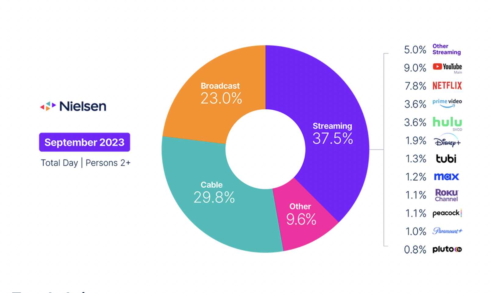
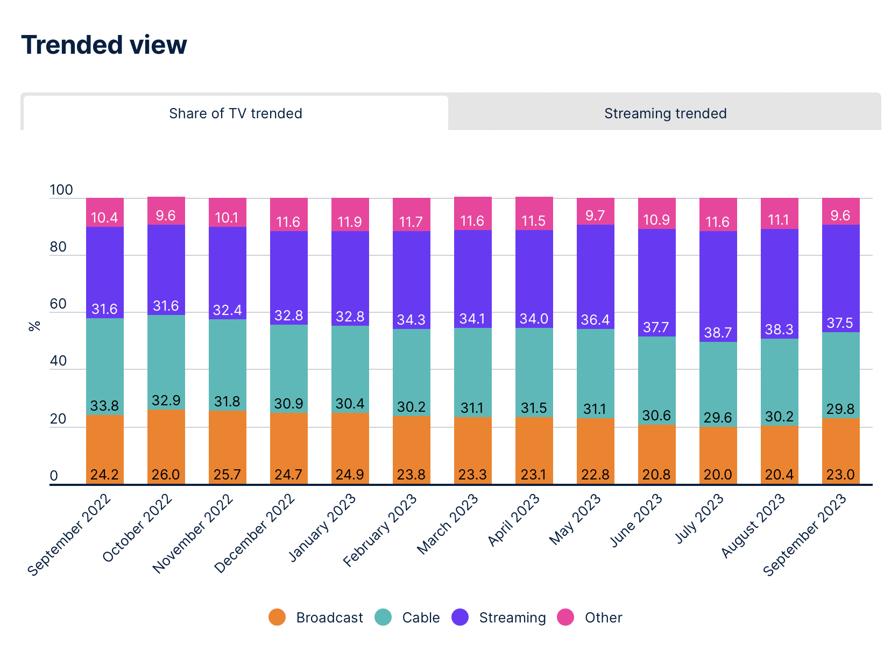

# 2024/ Week 30 Streaming Hits 40% of U.S. TV Usage for the Fi

**Data (data.world):** [https://data.world/makeovermonday/2024-week-30-streaming-hits-40-of-us-tv-usage-for-the-fi](https://data.world/makeovermonday/2024-week-30-streaming-hits-40-of-us-tv-usage-for-the-fi)

**Article / original viz:** [https://www.nielsen.com/insights/2023/sports-gave-broadcast-channels-a-second-straight-month-of-viewing-gains-in-september/](https://www.nielsen.com/insights/2023/sports-gave-broadcast-channels-a-second-straight-month-of-viewing-gains-in-september/)

**Original data source:** [https://www.nielsen.com/insights/2023/sports-gave-broadcast-channels-a-second-straight-month-of-viewing-gains-in-september/](https://www.nielsen.com/insights/2023/sports-gave-broadcast-channels-a-second-straight-month-of-viewing-gains-in-september/)

**Dataset:** `makeovermonday/2024-week-30-streaming-hits-40-of-us-tv-usage-for-the-fi`  
**Last updated on data.world:** 2024-07-21T22:21:15.853769169Z

---

---
{"editor":"simple"}
---
article:  [https://www.nielsen.com/insights/2023/sports-gave-broadcast-channels-a-second-straight-month-of-viewing-gains-in-september/](https://www.nielsen.com/insights/2023/sports-gave-broadcast-channels-a-second-straight-month-of-viewing-gains-in-september/)
source : nielsen

​

​

​

