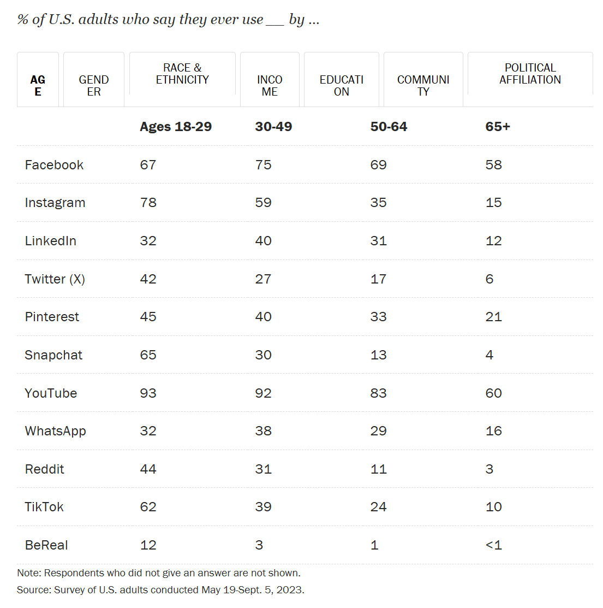

# Social Media Usage

**Data (data.world):** [https://data.world/makeovermonday/social-media-usage](https://data.world/makeovermonday/social-media-usage)

**Article / original viz:** [https://www.pewresearch.org/internet/fact-sheet/social-media/?tabItem=3345cffa-94a6-4e74-9272-70dee1e0e213#who-uses-each-social-media-platform](https://www.pewresearch.org/internet/fact-sheet/social-media/?tabItem=3345cffa-94a6-4e74-9272-70dee1e0e213#who-uses-each-social-media-platform)

**Original data source:** [https://www.pewresearch.org/internet/fact-sheet/social-media/?tabItem=3345cffa-94a6-4e74-9272-70dee1e0e213#who-uses-each-social-media-platform](https://www.pewresearch.org/internet/fact-sheet/social-media/?tabItem=3345cffa-94a6-4e74-9272-70dee1e0e213#who-uses-each-social-media-platform)

**Dataset:** `makeovermonday/social-media-usage`  
**Last updated on data.world:** 2024-08-19T13:25:37.447039796Z

---

Who uses each social media platform?

---
{"editor":"simple"}
---
# **Original Visualization**
​

​

SOURCE  & ARTICLE : [Demographics of Social Media Users and Adoption in the United States | Pew Research Center](https://www.pewresearch.org/internet/fact-sheet/social-media/?tabItem=3345cffa-94a6-4e74-9272-70dee1e0e213#who-uses-each-social-media-platform)