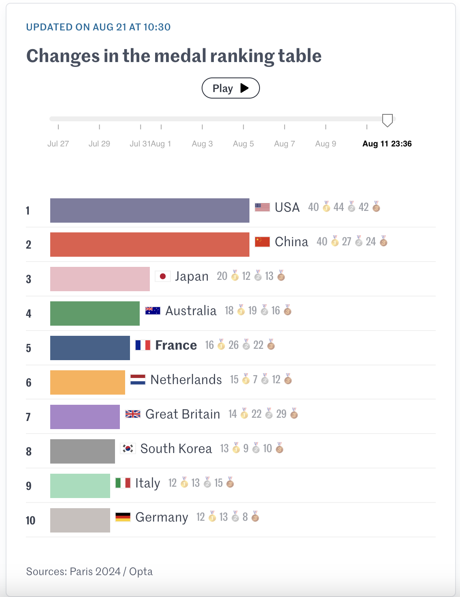

# 2024/W35 Paris 2024 Medal Count

**Data (data.world):** [https://data.world/makeovermonday/paris-2024-medal-cout](https://data.world/makeovermonday/paris-2024-medal-cout)

**Article / original viz:** [https://www.lemonde.fr/en/les-decodeurs/article/2024/08/07/paris-2024-olympics-how-the-medal-table-has-evolved-since-the-start-of-the-games_6711001_8.html](https://www.lemonde.fr/en/les-decodeurs/article/2024/08/07/paris-2024-olympics-how-the-medal-table-has-evolved-since-the-start-of-the-games_6711001_8.html)

**Original data source:** [https://olympics.com/en/paris-2024/medals](https://olympics.com/en/paris-2024/medals)

**Dataset:** `makeovermonday/paris-2024-medal-cout`  
**Last updated on data.world:** 2024-09-15T10:28:52.190614724Z

---

Paris 2024 Olympic medal count by country, sport & sporting event

---
{"editor":"simple"}
---
# **Original Visualization**

​

Datasource: [Olympics](https://olympics.com/en/paris-2024/medals)

Article: [Le Monde](https://www.lemonde.fr/en/les-decodeurs/article/2024/08/07/paris-2024-olympics-how-the-medal-table-has-evolved-since-the-start-of-the-games_6711001_8.html)