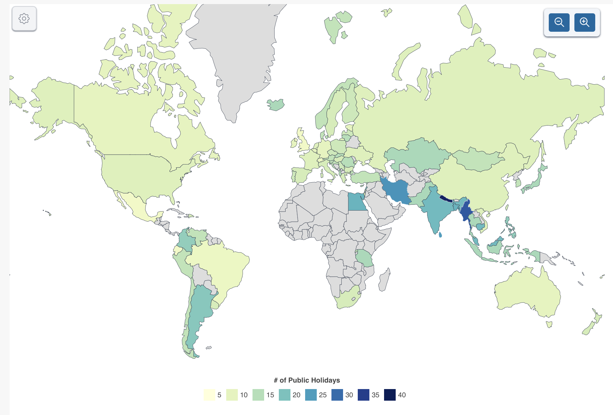

# 2024/W36 : Countries with the Most Holidays 2024

**Data (data.world):** [https://data.world/makeovermonday/2024w36-countries-with-the-most-holidays-2024](https://data.world/makeovermonday/2024w36-countries-with-the-most-holidays-2024)

**Article / original viz:** [https://worldpopulationreview.com/country-rankings/countries-with-the-most-holidays](https://worldpopulationreview.com/country-rankings/countries-with-the-most-holidays)

**Original data source:** [https://worldpopulationreview.com](https://worldpopulationreview.com)

**Dataset:** `makeovermonday/2024w36-countries-with-the-most-holidays-2024`  
**Last updated on data.world:** 2024-09-01T21:57:59.243607709Z

---

Countries with the Most Holidays 2024

---
{"editor":"simple"}
---
data from https://worldpopulationreview.com/country-rankings/countries-with-the-most-holidays 

"Most every culture and country in the world celebrates holidays. Holidays take many forms. Some are near-global public holidays such as [New Year's Eve](https://worldpopulationreview.com/country-rankings/which-country-celebrates-new-year-first), and some are celebrated by only a few countries, such as [Cinco de Mayo](https://worldpopulationreview.com/country-rankings/what-countries-celebrate-cinco-de-mayo) and [St. Patrick's Day](https://worldpopulationreview.com/country-rankings/how-many-countries-celebrate-st-patricks-day). Some are strictly religious, such as [Ramadan](https://worldpopulationreview.com/country-rankings/which-countries-celebrate-ramadan), some are strictly secular, such as [Thanksgiving](https://worldpopulationreview.com/country-rankings/countries-that-celebrate-thanksgiving), and some have both spiritual and secular elements, such as the fall and winter holidays ([Halloween](https://worldpopulationreview.com/country-rankings/countries-that-celebrate-halloween), [Dia de los Muertos](https://worldpopulationreview.com/country-rankings/what-countries-celebrate-day-of-the-dead), [Christmas](https://worldpopulationreview.com/country-rankings/countries-that-celebrate-christmas), Hanukkah, [Krampus](https://worldpopulationreview.com/country-rankings/what-countries-celebrate-krampus), and related holidays). But which country celebrates the most holidays of all?"

​

