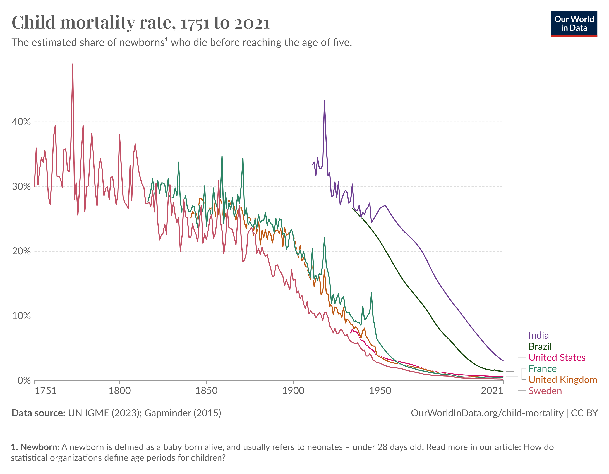

# Child and Infant Mortality

**Data (data.world):** [https://data.world/makeovermonday/child-and-infant-mortality](https://data.world/makeovermonday/child-and-infant-mortality)

**Article / original viz:** [https://ourworldindata.org/grapher/child-mortality?time=earliest..latest](https://ourworldindata.org/grapher/child-mortality?time=earliest..latest)

**Original data source:** [https://ourworldindata.org/grapher/child-mortality?time=earliest..latest](https://ourworldindata.org/grapher/child-mortality?time=earliest..latest)

**Dataset:** `makeovermonday/child-and-infant-mortality`  
**Last updated on data.world:** 2024-09-09T04:58:07.983705894Z

---

---
{"editor":"simple"}
---
**Original Visualization**

​

​

​

SOURCE  & ARTICLE : [Child and Infant Mortality - Our World in Data](https://ourworldindata.org/child-mortality?insight=millions-of-children-die-every-year#key-insights)

​