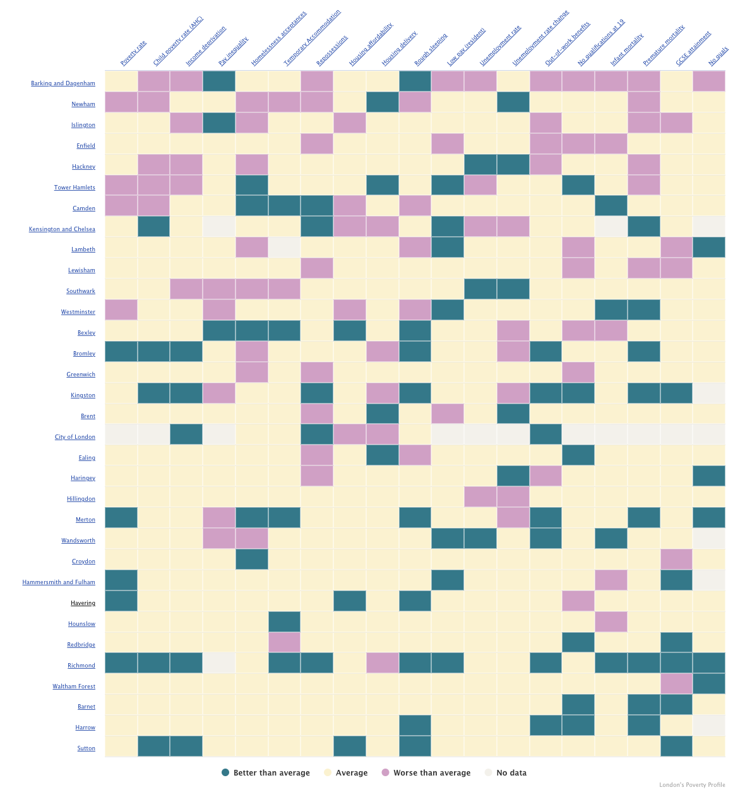

# 2024/W38 London's Poverty & Inequality Profile

**Data (data.world):** [https://data.world/makeovermonday/londons-poverty-inequality-profile](https://data.world/makeovermonday/londons-poverty-inequality-profile)

**Article / original viz:** [https://trustforlondon.org.uk/data/boroughs/overview-of-london-boroughs/](https://trustforlondon.org.uk/data/boroughs/overview-of-london-boroughs/)

**Original data source:** [https://www.ons.gov.uk/](https://www.ons.gov.uk/)

**Dataset:** `makeovermonday/londons-poverty-inequality-profile`  
**Last updated on data.world:** 2024-09-15T10:37:57.139016212Z

---

London’s 32 boroughs across different poverty and inequality indicators.

---
{"editor":"simple"}
---
# **Original Visualization**

Datasource: [ONS](https://www.ons.gov.uk/)

Article: [Trust for London](https://trustforlondon.org.uk/data/boroughs/overview-of-london-boroughs/)