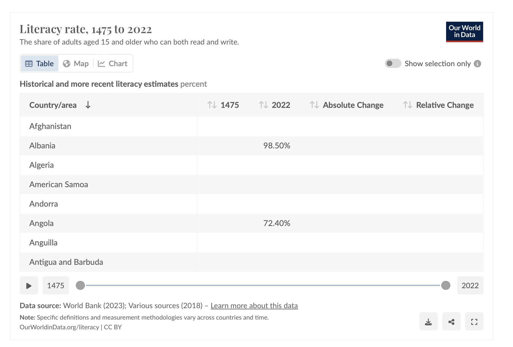

# 2024/w39 Literacy rate

**Data (data.world):** [https://data.world/makeovermonday/2024w39-literacy-rate](https://data.world/makeovermonday/2024w39-literacy-rate)

**Article / original viz:** [https://ourworldindata.org/literacy](https://ourworldindata.org/literacy)

**Original data source:** [https://ourworldindata.org/literacy](https://ourworldindata.org/literacy)

**Dataset:** `makeovermonday/2024w39-literacy-rate`  
**Last updated on data.world:** 2024-09-22T23:44:20.034403407Z

---

"Global literacy today  Of the world population older than 15 years, the majority are literate. " Ourworldindata

---
{"editor":"simple"}
---

Article : [https://ourworldindata.org/literacy](https://ourworldindata.org/literacy)

**Data source:** World Bank (2023); Various sources (2018) – Learn more about this data