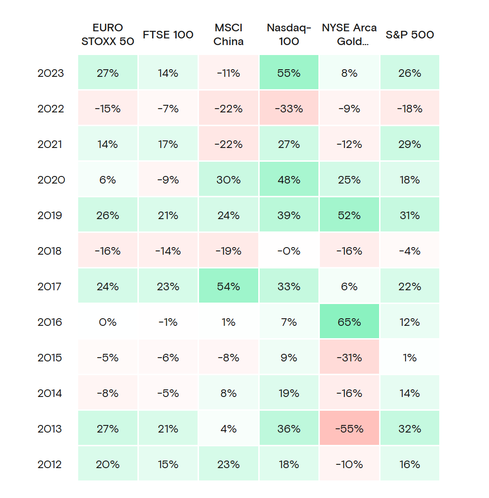

# Financial Markets Historical Performance

**Data (data.world):** [https://data.world/makeovermonday/financial-markets-historical-performance](https://data.world/makeovermonday/financial-markets-historical-performance)

**Article / original viz:** [https://curvo.eu/backtest/en/compare-indexes/euro-stoxx-50-vs-ftse-100-vs-msci-china-vs-nasdaq-100-vs-nyse-arca-gold-bugs-vs-sp-500?currency=usd](https://curvo.eu/backtest/en/compare-indexes/euro-stoxx-50-vs-ftse-100-vs-msci-china-vs-nasdaq-100-vs-nyse-arca-gold-bugs-vs-sp-500?currency=usd)

**Original data source:** [https://curvo.eu/backtest/en/compare-indexes/euro-stoxx-50-vs-ftse-100-vs-msci-china-vs-nasdaq-100-vs-nyse-arca-gold-bugs-vs-sp-500?currency=usd](https://curvo.eu/backtest/en/compare-indexes/euro-stoxx-50-vs-ftse-100-vs-msci-china-vs-nasdaq-100-vs-nyse-arca-gold-bugs-vs-sp-500?currency=usd)

**Dataset:** `makeovermonday/financial-markets-historical-performance`  
**Last updated on data.world:** 2024-09-30T01:32:48.005175585Z

---

Performance of the S&P 500 compared with other indices

---
{"editor":"simple"}
---
# **Original Visualization**

# **About this Dataset**
SOURCE: [FTSE 100 vs MSCI China vs Nasdaq-100 vs NYSE Arca Gold BUGS vs S&P 500: historical performance from 2008 to 2024 (curvo.eu)](https://curvo.eu/backtest/en/compare-indexes/euro-stoxx-50-vs-ftse-100-vs-msci-china-vs-nasdaq-100-vs-nyse-arca-gold-bugs-vs-sp-500?currency=usd)

\*Prices shown in dollars

# **Objectives**

* What works and what doesn't work with this chart?
* How can you make it better?
* Share your remakes on Linkedin and/or Twitter!