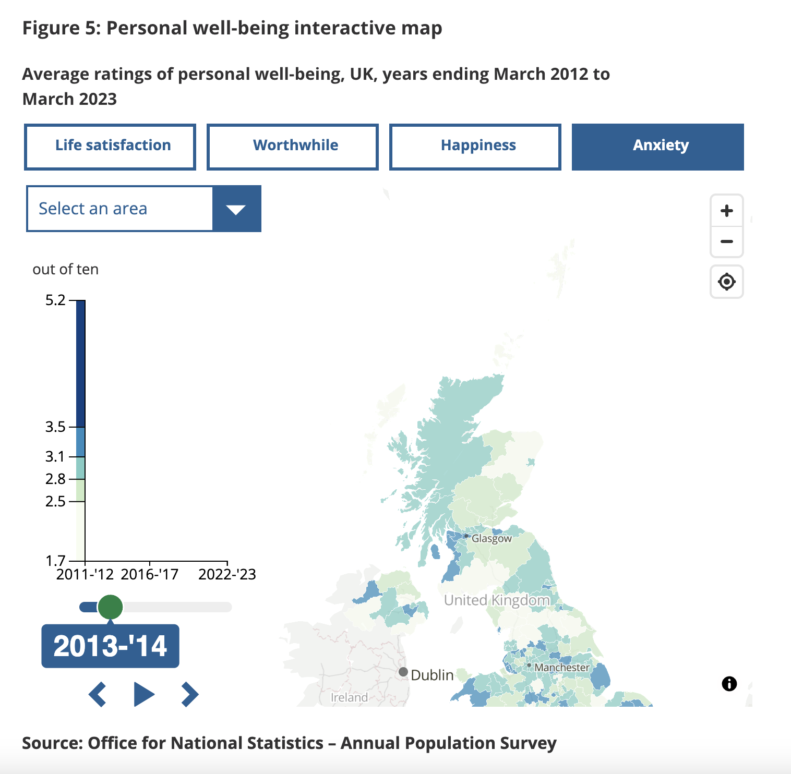

# 2024/W41 UK Average ratings of personal well-being 2012-2023

**Data (data.world):** [https://data.world/makeovermonday/2024w41-uk-average-ratings-of-personal-well-being-2012-2023](https://data.world/makeovermonday/2024w41-uk-average-ratings-of-personal-well-being-2012-2023)

**Article / original viz:** [https://www.ons.gov.uk/peoplepopulationandcommunity/wellbeing/bulletins/measuringnationalwellbeing/april2022tomarch2023](https://www.ons.gov.uk/peoplepopulationandcommunity/wellbeing/bulletins/measuringnationalwellbeing/april2022tomarch2023)

**Original data source:** [https://www.ons.gov.uk/peoplepopulationandcommunity/wellbeing/bulletins/measuringnationalwellbeing/april2022tomarch2023](https://www.ons.gov.uk/peoplepopulationandcommunity/wellbeing/bulletins/measuringnationalwellbeing/april2022tomarch2023)

**Dataset:** `makeovermonday/2024w41-uk-average-ratings-of-personal-well-being-2012-2023`  
**Last updated on data.world:** 2024-10-06T13:49:29.367411619Z

---

Average ratings of personal well-being, UK, years ending March 2012 to March 2023

---
{"editor":"simple"}
---
# **Original Visualization**

​

Datasource: [ONS](https://www.ons.gov.uk/peoplepopulationandcommunity/wellbeing/bulletins/measuringnationalwellbeing/april2022tomarch2023)

Article: [ONS](https://www.ons.gov.uk/peoplepopulationandcommunity/wellbeing/bulletins/measuringnationalwellbeing/april2022tomarch2023)