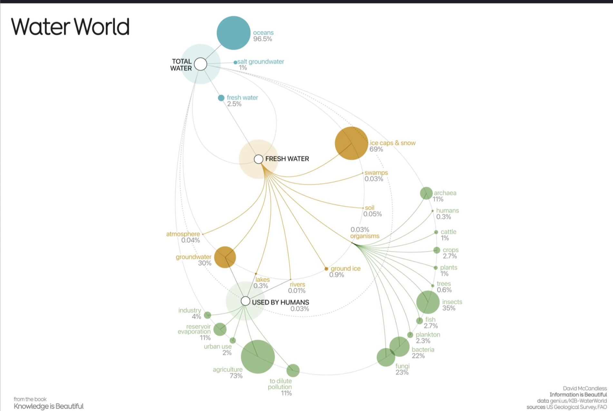

# 2024/ w42: water world

**Data (data.world):** [https://data.world/makeovermonday/2024-w42-water-world](https://data.world/makeovermonday/2024-w42-water-world)

**Article / original viz:** [https://informationisbeautiful.net/visualizations/water-world-distribution-of-the-all-the-water-in-all-the-world/](https://informationisbeautiful.net/visualizations/water-world-distribution-of-the-all-the-water-in-all-the-world/)

**Original data source:** [https://www.fao.org/aquastat/en/overview/methodology/water-use](https://www.fao.org/aquastat/en/overview/methodology/water-use)

**Dataset:** `makeovermonday/2024-w42-water-world`  
**Last updated on data.world:** 2024-10-13T16:50:02.929763615Z

---

---
{"editor":"simple"}
---
**Sources:**

[US Geological Survey](https://water.usgs.gov/edu/earthhowmuch.html), [Food & Agriculture Org of the United Nations (FAO)](https://www.fao.org/aquastat/en/overview/methodology/water-use)

**Credits:**

design & research: David McCandless  research: Miriam Quick

​

