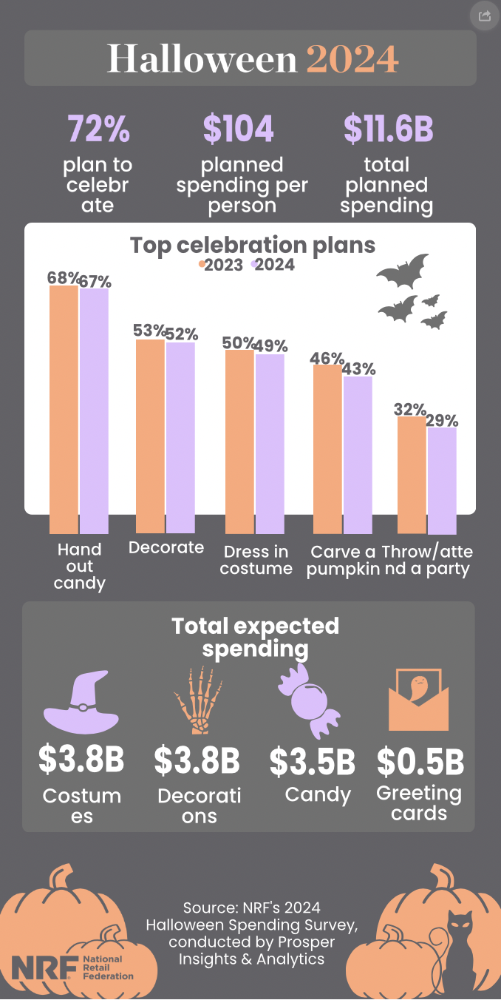

# 2024/w44: Halloween

**Data (data.world):** [https://data.world/makeovermonday/2024w44-halloween](https://data.world/makeovermonday/2024w44-halloween)

**Article / original viz:** [https://nrf.com/research-insights/holiday-data-and-trends/halloween/halloween-data-center](https://nrf.com/research-insights/holiday-data-and-trends/halloween/halloween-data-center)

**Original data source:** [https://nrf.com/research-insights/holiday-data-and-trends/halloween](https://nrf.com/research-insights/holiday-data-and-trends/halloween)

**Dataset:** `makeovermonday/2024w44-halloween`  
**Last updated on data.world:** 2024-10-28T06:58:49.187324295Z

---

---
{"editor":"simple"}
---
data from NRF

https://nrf.com/research-insights/holiday-data-and-trends/halloween/halloween-data-center

https://nrf.com/research-insights/holiday-data-and-trends/halloween

​

