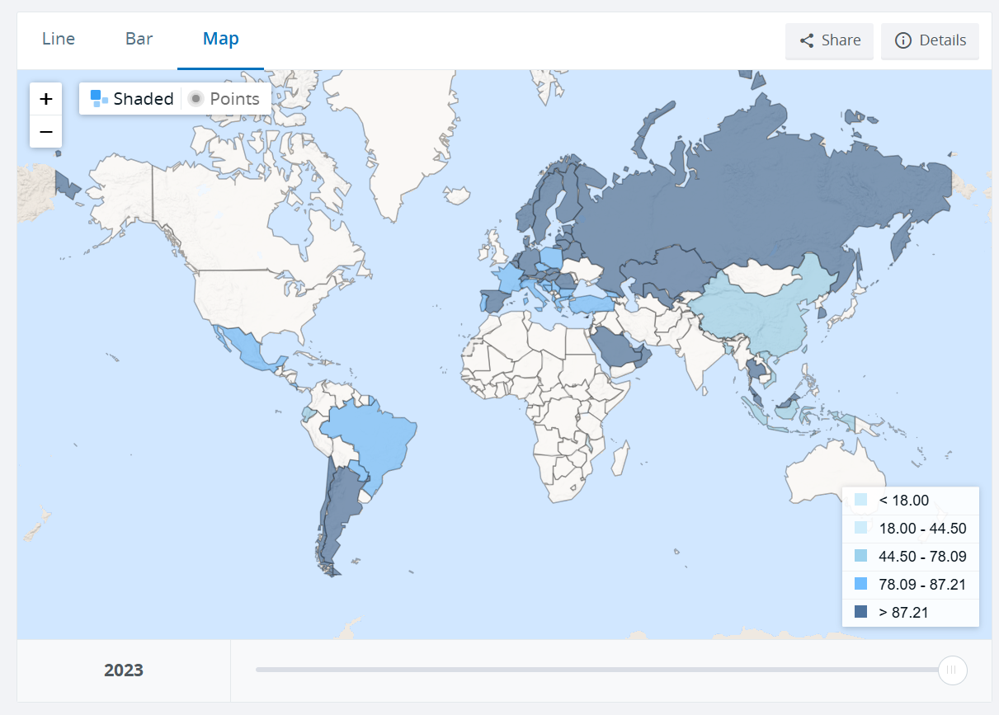

# Individuals using the Internet (% of population)

**Data (data.world):** [https://data.world/makeovermonday/individuals-using-the-internet-of-population](https://data.world/makeovermonday/individuals-using-the-internet-of-population)

**Article / original viz:** [https://data.worldbank.org/indicator/IT.NET.USER.ZS?end=2023&start=2023&view=map&year=2023](https://data.worldbank.org/indicator/IT.NET.USER.ZS?end=2023&start=2023&view=map&year=2023)

**Original data source:** [https://data.worldbank.org/indicator/IT.NET.USER.ZS?end=2023&start=2023&view=map&year=2023](https://data.worldbank.org/indicator/IT.NET.USER.ZS?end=2023&start=2023&view=map&year=2023)

**Dataset:** `makeovermonday/individuals-using-the-internet-of-population`  
**Last updated on data.world:** 2024-11-04T19:54:28.283894731Z

---

This is the proportion of people that use the internet across the world.

---
{"editor":"simple"}
---
# **Original Visualization**

​

Datasource: [Individuals using the Internet (% of population) | Data](https://data.worldbank.org/indicator/IT.NET.USER.ZS?end=2023&start=2023&view=map&year=2023)

Article: [Individuals using the Internet (% of population) | Data](https://data.worldbank.org/indicator/IT.NET.USER.ZS?end=2023&start=2023&view=map&year=2023)