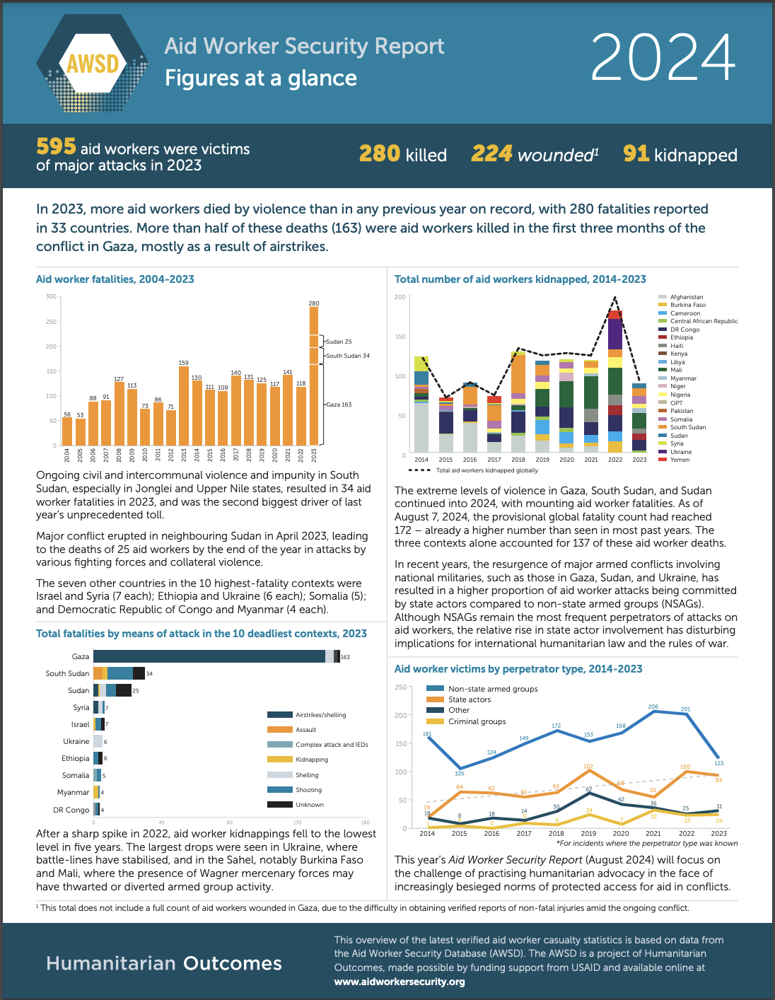

# 2024/W46 Aid Worker Security Incidents

**Data (data.world):** [https://data.world/makeovermonday/2024w46-aid-worker-security-incidents](https://data.world/makeovermonday/2024w46-aid-worker-security-incidents)

**Article / original viz:** [https://humanitarianoutcomes.org/sites/default/files/publications/figures_at_a_glance_2024.pdf](https://humanitarianoutcomes.org/sites/default/files/publications/figures_at_a_glance_2024.pdf)

**Original data source:** [https://www.aidworkersecurity.org/incidents/search](https://www.aidworkersecurity.org/incidents/search)

**Dataset:** `makeovermonday/2024w46-aid-worker-security-incidents`  
**Last updated on data.world:** 2024-11-10T13:33:39.805653798Z

---

Aid Worker Security Incidents 1997-2024

---
{"editor":"simple"}
---
# **Original Visualization**

Datasource: [Aid Worker Security Database](https://www.aidworkersecurity.org/incidents/search)

Article: [Aid Worker Security Database](https://humanitarianoutcomes.org/sites/default/files/publications/figures_at_a_glance_2024.pdf)