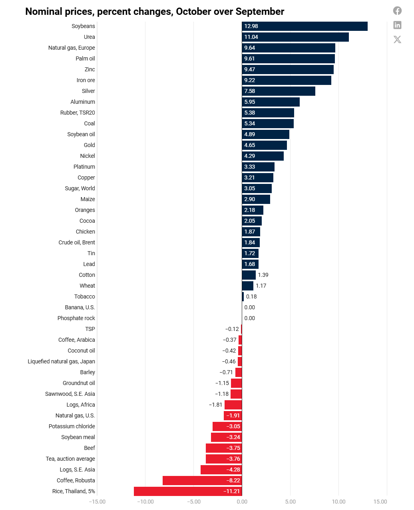

# Gains in Commodity Prices

**Data (data.world):** [https://data.world/makeovermonday/gains-in-commodity-prices](https://data.world/makeovermonday/gains-in-commodity-prices)

**Article / original viz:** [https://blogs.worldbank.org/en/opendata/commodity-prices-post-modest-gains-in-october-pink-sheet](https://blogs.worldbank.org/en/opendata/commodity-prices-post-modest-gains-in-october-pink-sheet)

**Original data source:** [https://blogs.worldbank.org/en/opendata/commodity-prices-post-modest-gains-in-october-pink-sheet](https://blogs.worldbank.org/en/opendata/commodity-prices-post-modest-gains-in-october-pink-sheet)

**Dataset:** `makeovermonday/gains-in-commodity-prices`  
**Last updated on data.world:** 2024-11-25T16:14:00.467394496Z

---

Changes in the price of different commodities

---
{"editor":"simple"}
---
# **Original Visualization**

​

Datasource : [Commodity prices post modest gains in October—Pink Sheet](https://blogs.worldbank.org/en/opendata/commodity-prices-post-modest-gains-in-october-pink-sheet)

**Notes:  
**While the visualization above shows month over month change in commodity prices from September to October, the data provides yearly data for commodities, and provides the ability to analyze year over year changes.

Units:

* **$/bbl**: Price in US dollars per barrel. A barrel is a standard unit of measure for crude oil and other liquid fuels.
* **$/mmbtu**: Price in US dollars per million British thermal units. A unit of energy commonly used for natural gas.
* **$/kg**: Price in US dollars per kilogram. Frequently used for agricultural products like cocoa, coffee, and tea.
* **$/toz**: Price in US dollars per troy ounce. A unit of weight used for precious metals like gold, silver, and platinum
* **$/mt**: Price in US dollars per metric ton. Commonly used for bulk commodities like coal, metals, and grains.