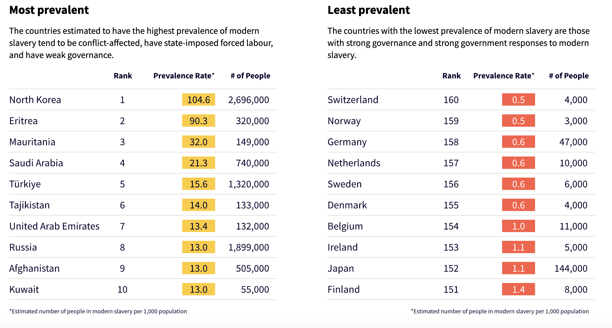

# 2024/W49 Global Slavery Index

**Data (data.world):** [https://data.world/makeovermonday/2024w47-global-slavery-index](https://data.world/makeovermonday/2024w47-global-slavery-index)

**Article / original viz:** [https://www.walkfree.org/global-slavery-index/#:~:text=An%20estimated%2050%20million%20people,10%20million%20people%20since%202016.](https://www.walkfree.org/global-slavery-index/#:~:text=An%20estimated%2050%20million%20people,10%20million%20people%20since%202016.)

**Original data source:** [https://www.walkfree.org/global-slavery-index/downloads/](https://www.walkfree.org/global-slavery-index/downloads/)

**Dataset:** `makeovermonday/2024w47-global-slavery-index`  
**Last updated on data.world:** 2024-12-01T17:11:49.760069538Z

---

Global Slavery Index 2023

---
{"editor":"simple"}
---
# **Original Visualization**
​

​

Datasource: [Walk Free](https://www.walkfree.org/global-slavery-index/downloads/)

Article: [Walk Free](https://www.walkfree.org/global-slavery-index/#:~:text=An%20estimated%2050%20million%20people,10%20million%20people%20since%202016.)