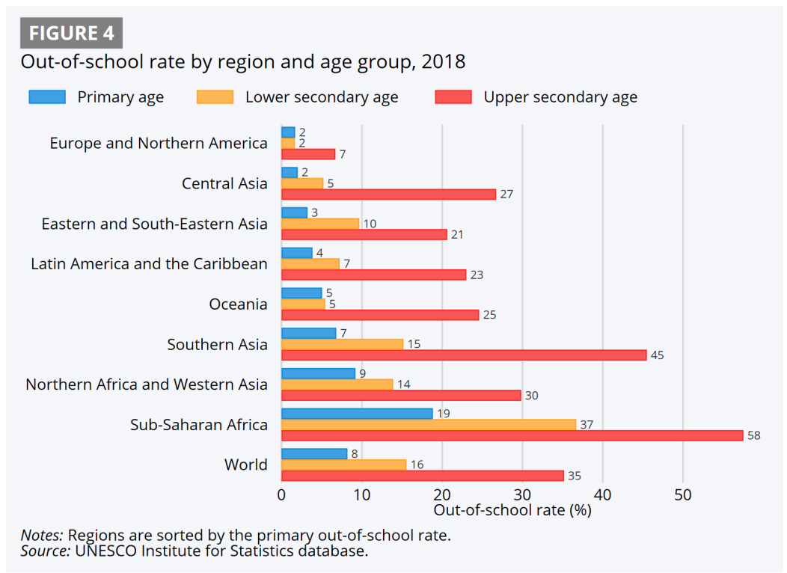

# Out of School Youths and Adolescents

**Data (data.world):** [https://data.world/makeovermonday/out-of-school-youths-and-adolescents](https://data.world/makeovermonday/out-of-school-youths-and-adolescents)

**Article / original viz:** [https://uis.unesco.org/sites/default/files/documents/new-methodology-shows-258-million-children-adolescents-and-youth-are-out-school.pdf](https://uis.unesco.org/sites/default/files/documents/new-methodology-shows-258-million-children-adolescents-and-youth-are-out-school.pdf)

**Original data source:** [https://uis.unesco.org/sites/default/files/documents/new-methodology-shows-258-million-children-adolescents-and-youth-are-out-school.pdf](https://uis.unesco.org/sites/default/files/documents/new-methodology-shows-258-million-children-adolescents-and-youth-are-out-school.pdf)

**Dataset:** `makeovermonday/out-of-school-youths-and-adolescents`  
**Last updated on data.world:** 2024-12-17T09:32:34.195317223Z

---

Out-of-school children, adolescents and youth: Global status and trends

---
{"editor":"simple"}
---
# **Original Visualization**

​

Datasource and Article: [new-methodology-shows-258-million-children-adolescents-and-youth-are-out-school.pdf](https://uis.unesco.org/sites/default/files/documents/new-methodology-shows-258-million-children-adolescents-and-youth-are-out-school.pdf)