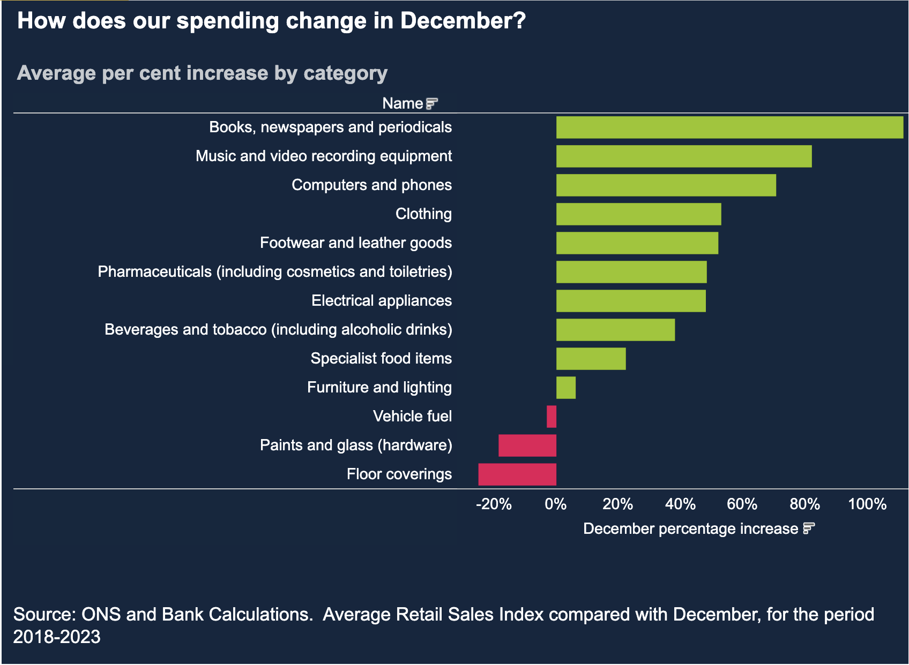

# 2024/W52 How Does Our Spending Change in December?

**Data (data.world):** [https://data.world/makeovermonday/2024w52-how-does-our-spending-change-in-december](https://data.world/makeovermonday/2024w52-how-does-our-spending-change-in-december)

**Article / original viz:** [https://www.bankofengland.co.uk/explainers/how-much-do-we-spend-at-christmas](https://www.bankofengland.co.uk/explainers/how-much-do-we-spend-at-christmas)

**Original data source:** [https://www.bankofengland.co.uk/explainers/how-much-do-we-spend-at-christmas](https://www.bankofengland.co.uk/explainers/how-much-do-we-spend-at-christmas)

**Dataset:** `makeovermonday/2024w52-how-does-our-spending-change-in-december`  
**Last updated on data.world:** 2024-12-22T12:13:35.228986082Z

---

December Average Percent Increase By Commodity Category

---
{"editor":"simple"}
---
# **Original Visualization**

Datasource: [ONS and Bank Calculations](https://www.bankofengland.co.uk/explainers/how-much-do-we-spend-at-christmas)

Article: [Bank of England](https://www.bankofengland.co.uk/explainers/how-much-do-we-spend-at-christmas)