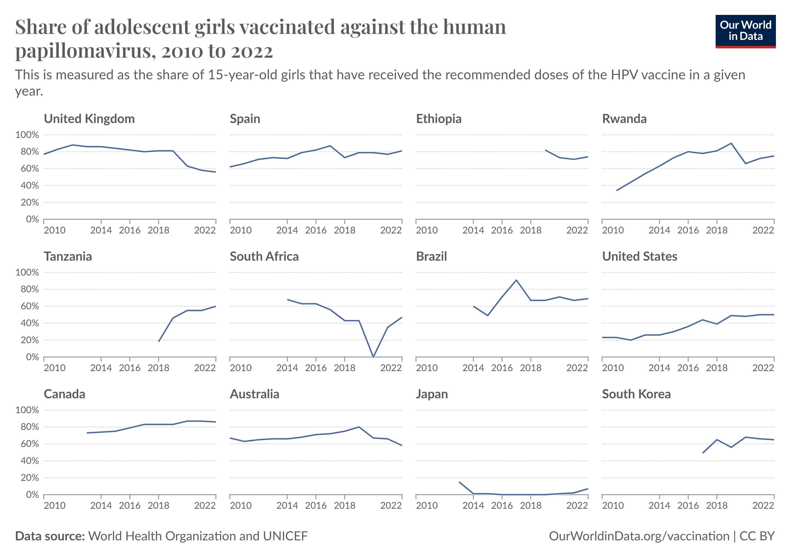

# 2025/ Week 2 Coverage of the HPV Vaccine

**Data (data.world):** [https://data.world/makeovermonday/coverage-of-the-hpv-vaccine](https://data.world/makeovermonday/coverage-of-the-hpv-vaccine)

**Article / original viz:** [https://ourworldindata.org/hpv-vaccination-world-can-eliminate-cervical-cancer](https://ourworldindata.org/hpv-vaccination-world-can-eliminate-cervical-cancer)

**Original data source:** [https://ourworldindata.org/hpv-vaccination-world-can-eliminate-cervical-cancer](https://ourworldindata.org/hpv-vaccination-world-can-eliminate-cervical-cancer)

**Dataset:** `makeovermonday/coverage-of-the-hpv-vaccine`  
**Last updated on data.world:** 2025-01-05T23:20:30.336346598Z

---

Proportion of the target who received the final dose of (HPV) vaccine (%)

---
{"editor":"simple"}
---
# **Original Visualization**

​

Datasource / Article : [HPV vaccination: How the world can eliminate cervical cancer - Our World in Data](https://ourworldindata.org/hpv-vaccination-world-can-eliminate-cervical-cancer)