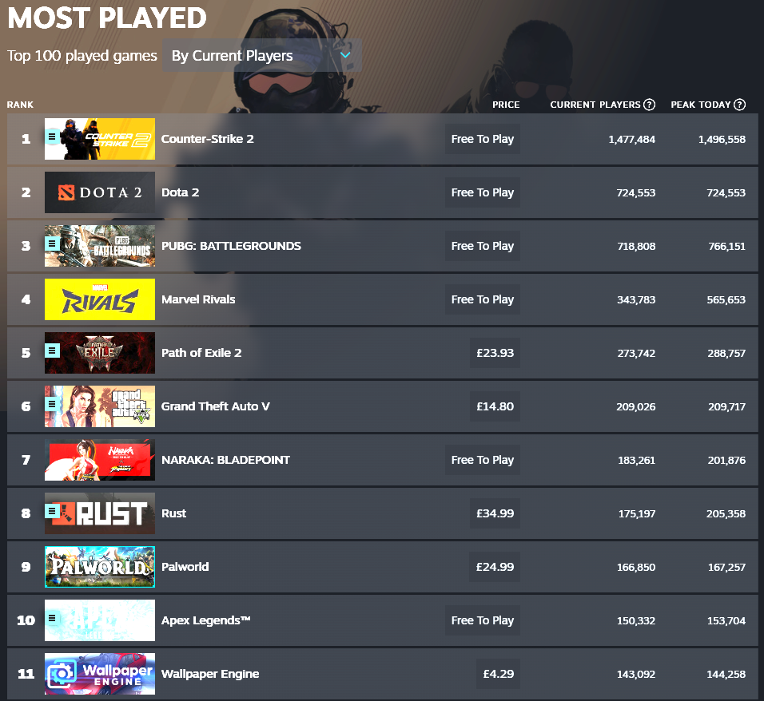

# 2025/W3 Steam Top 100 Played Games

**Data (data.world):** [https://data.world/makeovermonday/2025w3-steam-top-100-played-games](https://data.world/makeovermonday/2025w3-steam-top-100-played-games)

**Article / original viz:** [https://store.steampowered.com/charts/mostplayed](https://store.steampowered.com/charts/mostplayed)

**Original data source:** [https://store.steampowered.com/charts/mostplayed](https://store.steampowered.com/charts/mostplayed)

**Dataset:** `makeovermonday/2025w3-steam-top-100-played-games`  
**Last updated on data.world:** 2025-01-12T14:43:56.656672351Z

---

Top 100 Played Games on Steam - Extracted 12/01/2025

---
{"editor":"simple"}
---
# **Original Visualization**

Datasource: [Steam](https://store.steampowered.com/charts/mostplayed)

Article: [Steam](https://store.steampowered.com/charts/mostplayed)