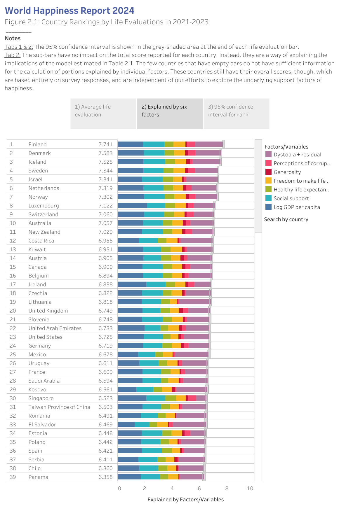

# 2025/ week 5 World Happiness Report 2024

**Data (data.world):** [https://data.world/makeovermonday/2025-week-4-world-happiness-report-2024](https://data.world/makeovermonday/2025-week-4-world-happiness-report-2024)

**Article / original viz:** [https://worldhappiness.report/ed/2024/happiness-of-the-younger-the-older-and-those-in-between/#ranking-of-happiness-2021-2023](https://worldhappiness.report/ed/2024/happiness-of-the-younger-the-older-and-those-in-between/#ranking-of-happiness-2021-2023)

**Original data source:** [https://worldhappiness.report/data/](https://worldhappiness.report/data/)

**Dataset:** `makeovermonday/2025-week-4-world-happiness-report-2024`  
**Last updated on data.world:** 2025-01-27T19:36:24.939297445Z

---

---
{"editor":"simple"}
---
# **Original Visualization**

# **About this Dataset**
**ARTICLE:** [Happiness of the younger, the older, and those in between | The World Happiness Report](https://worldhappiness.report/ed/2024/happiness-of-the-younger-the-older-and-those-in-between/#ranking-of-happiness-2021-2023)
**DATA SOURCE:** [World Happiness Report Data Dashboard | The World Happiness Report](https://worldhappiness.report/data/)

# **Objectives**
\* What works and what doesn't work with this chart?
\* How can you make it better?
\* Post your alternative on Linkedin/X/Discussions Page