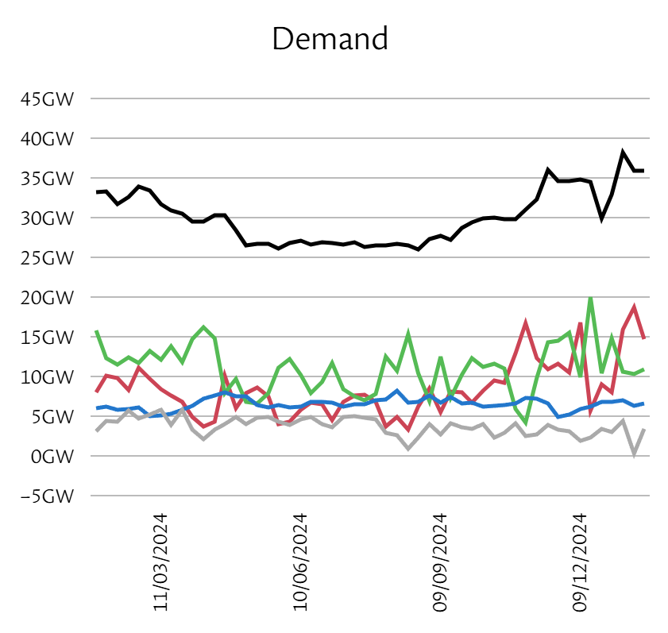

# 2025/W6 Britain's National Grid Energy Sources

**Data (data.world):** [https://data.world/makeovermonday/2025w6-britains-national-grid-energy-sources](https://data.world/makeovermonday/2025w6-britains-national-grid-energy-sources)

**Article / original viz:** [https://grid.iamkate.com/](https://grid.iamkate.com/)

**Original data source:** [https://grid.iamkate.com/](https://grid.iamkate.com/)

**Dataset:** `makeovermonday/2025w6-britains-national-grid-energy-sources`  
**Last updated on data.world:** 2025-02-02T10:33:28.569648090Z

---

YTD National Grid energy demands and breakdown of sources

---
{"editor":"simple"}
---
# **Original Visualization**

​

Datasource: [Elexon Insights Solution, National Grid ESO’s Data Portal, and the Carbon Intensity API](https://grid.iamkate.com/)

Article: [National Grid: Live](https://grid.iamkate.com/)