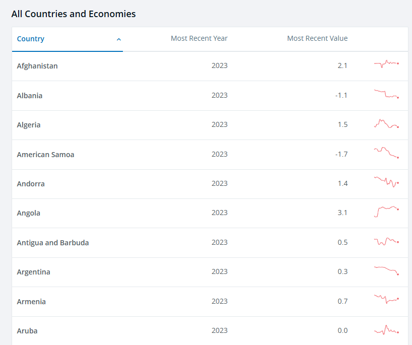

# 2025/W9 World Population Estimates & Projections

**Data (data.world):** [https://data.world/makeovermonday/2025w9-world-population-estimates-projections](https://data.world/makeovermonday/2025w9-world-population-estimates-projections)

**Article / original viz:** [https://data.worldbank.org/indicator/SP.POP.GROW?name_desc=false](https://data.worldbank.org/indicator/SP.POP.GROW?name_desc=false)

**Original data source:** [https://datacatalog.worldbank.org/search/dataset/0037655/Population-Estimates-and-Projections](https://datacatalog.worldbank.org/search/dataset/0037655/Population-Estimates-and-Projections)

**Dataset:** `makeovermonday/2025w9-world-population-estimates-projections`  
**Last updated on data.world:** 2025-02-23T11:31:54.711652373Z

---

Population estimates and projections until 2050 by region & country.

---
{"editor":"simple"}
---
# **Original Visualization**

Datasource: [World Bank Group](https://datacatalog.worldbank.org/search/dataset/0037655/Population-Estimates-and-Projections)

Article: [World Bank Group](https://data.worldbank.org/indicator/SP.POP.GROW?name_desc=false)