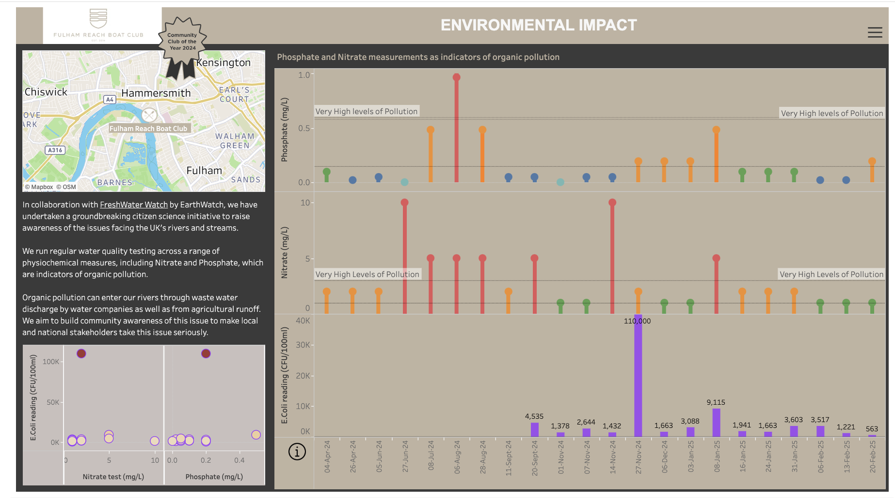

# 2025/ week 10   River Water Quality

**Data (data.world):** [https://data.world/makeovermonday/2025-week-10-river-water-quality](https://data.world/makeovermonday/2025-week-10-river-water-quality)

**Article / original viz:** [https://data.world/makeovermonday/2025-week-10-river-water-quality/workspace/file?filename=_Makeover+Monday+with+Fulham+Reach+Boat+Club.docx.pdf](https://data.world/makeovermonday/2025-week-10-river-water-quality/workspace/file?filename=_Makeover+Monday+with+Fulham+Reach+Boat+Club.docx.pdf)

**Original data source:** [https://www.fulhamreachboatclub.co.uk/courses?gclid=Cj0KCQiAoJC-BhCSARIsAPhdfShZbMZ7_z72KctTqU6S5V8pYvfDNjWDgvr4p5VMPqXSV4_Ggu2rYwsaAiLZEALw_wcB](https://www.fulhamreachboatclub.co.uk/courses?gclid=Cj0KCQiAoJC-BhCSARIsAPhdfShZbMZ7_z72KctTqU6S5V8pYvfDNjWDgvr4p5VMPqXSV4_Ggu2rYwsaAiLZEALw_wcB)

**Dataset:** `makeovermonday/2025-week-10-river-water-quality`  
**Last updated on data.world:** 2025-03-02T18:10:33.326103378Z

---

---
{"editor":"simple"}
---
**Problem Statement**

Can we use weather, river flow and water quality data to better understand the forces that impact water in London at Fulham Reach Boat Club, located at Hammersmith Bridge.

**Future Goal**

With better understanding can we get better at predicting when water quality will be poor, this would be advantageous as we only have capacity to test once a week and the results of E.Coli testing takes a day to process.

data from [Fulham Reach Boat Club (FRBC)](https://data.world/makeovermonday/2025-week-10-river-water-quality/workspace/file?filename=_Makeover+Monday+with+Fulham+Reach+Boat+Club.docx.pdf)

​

Visualisation: [https://public.tableau.com/app/profile/fulham.reach.boat.club/viz/FRBCFreshWaterWatch\\\_17116616886720/eColi](https://public.tableau.com/app/profile/fulham.reach.boat.club/viz/FRBCFreshWaterWatch%5C_17116616886720/eColi)