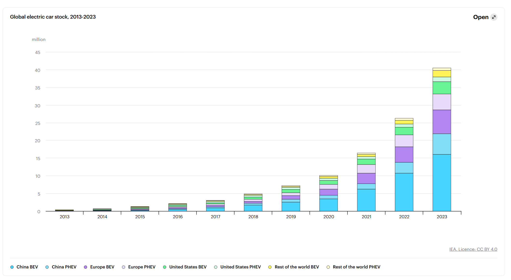

# 2025/ week 11 Electric car sales

**Data (data.world):** [https://data.world/makeovermonday/2025-week-11-electric-car-sales](https://data.world/makeovermonday/2025-week-11-electric-car-sales)

**Article / original viz:** [https://www.iea.org/reports/global-ev-outlook-2024/trends-in-electric-cars](https://www.iea.org/reports/global-ev-outlook-2024/trends-in-electric-cars)

**Original data source:** [https://www.iea.org/data-and-statistics/data-tools/global-ev-data-explorer](https://www.iea.org/data-and-statistics/data-tools/global-ev-data-explorer)

**Dataset:** `makeovermonday/2025-week-11-electric-car-sales`  
**Last updated on data.world:** 2025-03-10T16:35:11.334428800Z

---

---
{"editor":"simple"}
---
# **Original Visualization**
​

​

Datasource: [Global EV Data Explorer – Data Tools - IEA](https://www.iea.org/data-and-statistics/data-tools/global-ev-data-explorer)

Article: [Trends in electric cars – Global EV Outlook 2024 – Analysis - IEA](https://www.iea.org/reports/global-ev-outlook-2024/trends-in-electric-cars)

Show less