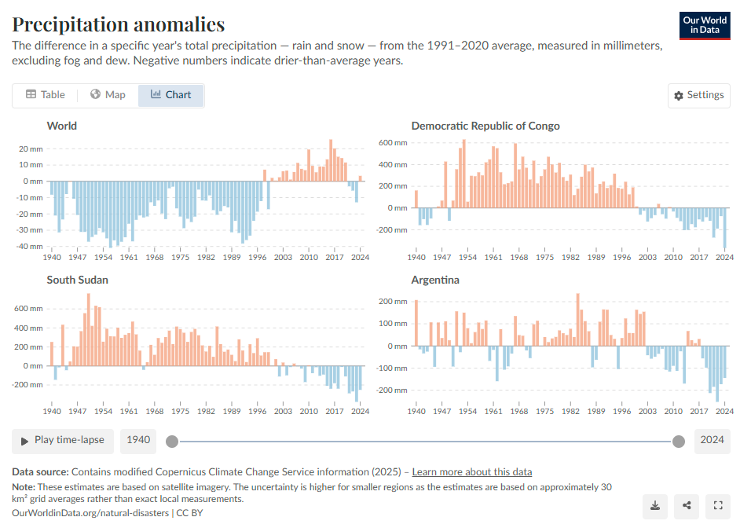

# 2025/W12 Precipitation Anomalies

**Data (data.world):** [https://data.world/makeovermonday/2025w12-precipitation-anomalies](https://data.world/makeovermonday/2025w12-precipitation-anomalies)

**Article / original viz:** [https://ourworldindata.org/grapher/global-precipitation-anomaly](https://ourworldindata.org/grapher/global-precipitation-anomaly)

**Original data source:** [https://ourworldindata.org/grapher/global-precipitation-anomaly](https://ourworldindata.org/grapher/global-precipitation-anomaly)

**Dataset:** `makeovermonday/2025w12-precipitation-anomalies`  
**Last updated on data.world:** 2025-03-17T13:40:16.919822346Z

---

The difference in a specific year's total precipitation — rain and snow — from the 1991–2020 average, measured in mm.

---
{"editor":"simple"}
---
# **Original Visualization**

Datasource: [Our World In Data](https://ourworldindata.org/grapher/global-precipitation-anomaly)

Article: [Our World In Data](https://ourworldindata.org/grapher/global-precipitation-anomaly)