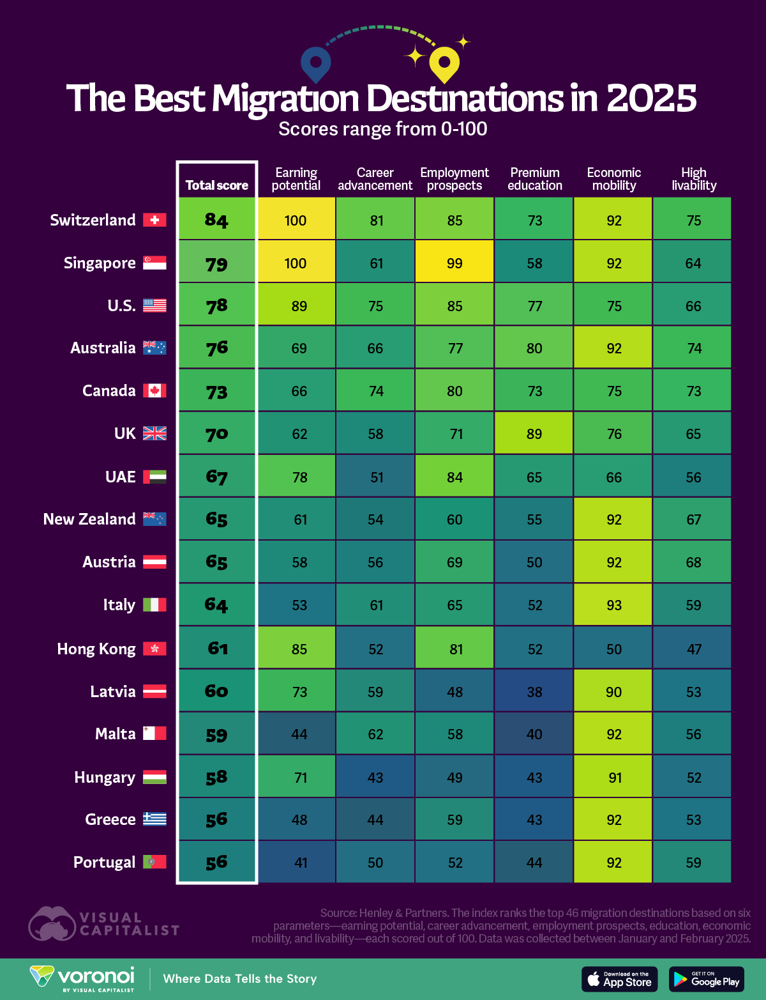

# 2025/ week 14 The Best Migration Destinations in 2025

**Data (data.world):** [https://data.world/makeovermonday/2025-week-14-the-best-migration-destinations-in-2025](https://data.world/makeovermonday/2025-week-14-the-best-migration-destinations-in-2025)

**Article / original viz:** [https://www.visualcapitalist.com/ranked-2025s-best-countries-to-live-and-work/#google_vignette](https://www.visualcapitalist.com/ranked-2025s-best-countries-to-live-and-work/#google_vignette)

**Original data source:** [https://www.henleyglobal.com/publications/henley-opportunity-index/](https://www.henleyglobal.com/publications/henley-opportunity-index/)

**Dataset:** `makeovermonday/2025-week-14-the-best-migration-destinations-in-2025`  
**Last updated on data.world:** 2025-03-31T18:03:29.195185041Z

---

2025’s Best Countries to Live and Work Based on the Henley Opportunity Index

---
{"editor":"simple"}
---
# **Original Visualization**

​

Datasource: [The Henley Opportunity Index 2025 | Henley & Partners](https://www.henleyglobal.com/publications/henley-opportunity-index)

Article: [Ranked: 2025's Best Countries to Live and Work](https://www.visualcapitalist.com/ranked-2025s-best-countries-to-live-and-work/#google_vignette)

Show less