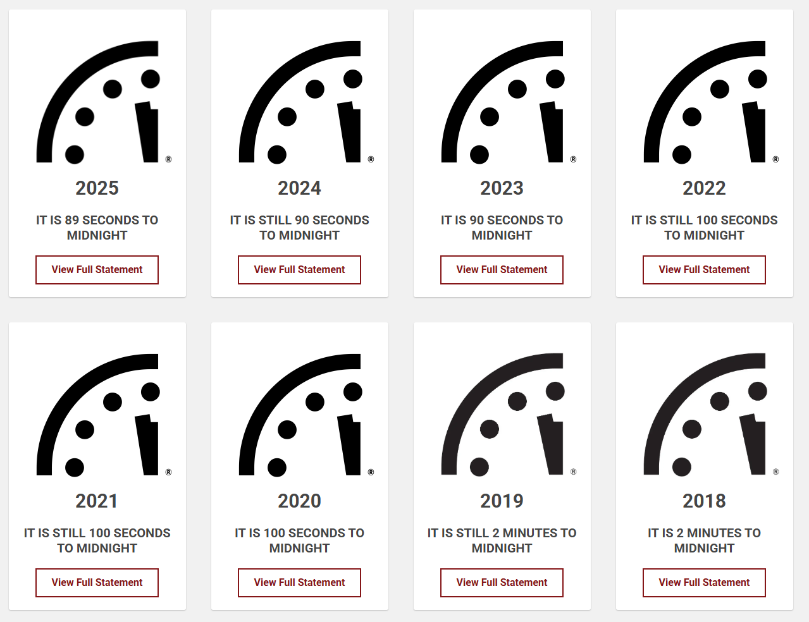

# 2025/W15 Doomsday Clock

**Data (data.world):** [https://data.world/makeovermonday/2025w15-doomsday-clock](https://data.world/makeovermonday/2025w15-doomsday-clock)

**Article / original viz:** [https://thebulletin.org/doomsday-clock/timeline/](https://thebulletin.org/doomsday-clock/timeline/)

**Original data source:** [https://thebulletin.org/doomsday-clock/timeline/](https://thebulletin.org/doomsday-clock/timeline/)

**Dataset:** `makeovermonday/2025w15-doomsday-clock`  
**Last updated on data.world:** 2025-04-08T07:56:37.669975845Z

---

Doomsday Clock 1947-2025

---
{"editor":"simple"}
---
# **Original Visualization**

Datasource: [Bulletin of the Atomic Scientists](https://thebulletin.org/doomsday-clock/timeline/)

Article: [Bulletin of the Atomic Scientists](https://thebulletin.org/doomsday-clock/timeline/)