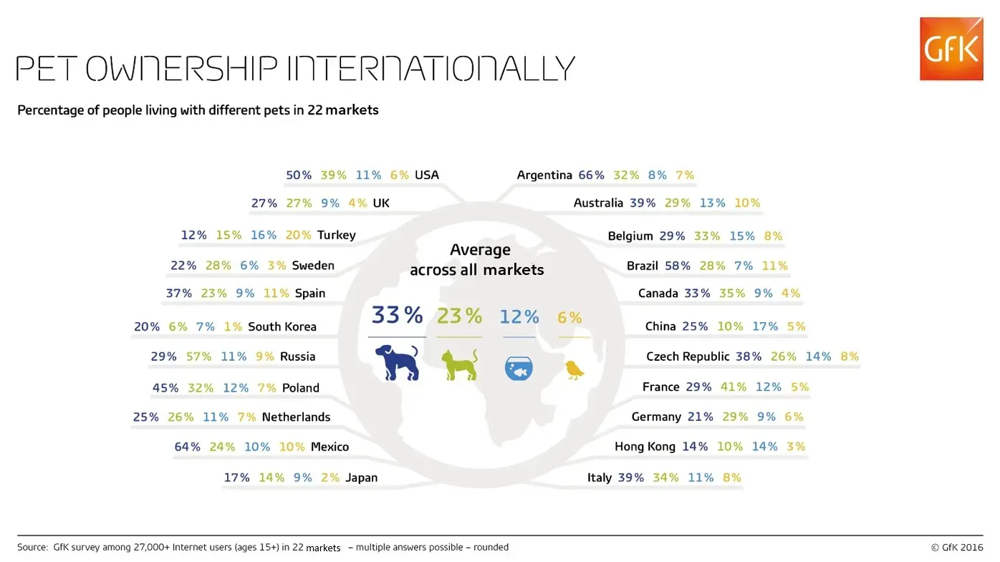

# 2025/ week 14  Pet Ownership

**Data (data.world):** [https://data.world/makeovermonday/2025-week-14-pet-ownership](https://data.world/makeovermonday/2025-week-14-pet-ownership)

**Article / original viz:** [https://nielseniq.com/global/en/insights/report/2016/mans-best-friend-global-pet-ownership-and-feeding-trends/#:%5C~:text=More%20than%20half%20of%20people,likely%20to%20own%20a%20pet](https://nielseniq.com/global/en/insights/report/2016/mans-best-friend-global-pet-ownership-and-feeding-trends/#:%5C~:text=More%20than%20half%20of%20people,likely%20to%20own%20a%20pet)

**Original data source:** [https://www.google.com/search?gs_ssp=eJzj4tTP1TcwTU_PMlVgNGB0YPBiTk_LBgAzlQTI&q=gfk&oq=gfk&gs_lcrp=EgZjaHJvbWUqEAgBEC4YxwEYsQMY0QMYgAQyBggAEEUYOzIQCAEQLhjHARixAxjRAxiABDIGCAIQRRhAMgcIAxAAGIAEMg0IBBAuGK8BGMcBGIAEMgcIBRAAGIAEMgcIBhAAGIAEMg0IBxAuGK8BGMcBGIAE0gEJNTM3OWowajE1qAIIsAIB8QX9fm5tdwXQ3A&sourceid=chrome&ie=UTF-8](https://www.google.com/search?gs_ssp=eJzj4tTP1TcwTU_PMlVgNGB0YPBiTk_LBgAzlQTI&q=gfk&oq=gfk&gs_lcrp=EgZjaHJvbWUqEAgBEC4YxwEYsQMY0QMYgAQyBggAEEUYOzIQCAEQLhjHARixAxjRAxiABDIGCAIQRRhAMgcIAxAAGIAEMg0IBBAuGK8BGMcBGIAEMgcIBRAAGIAEMgcIBhAAGIAEMg0IBxAuGK8BGMcBGIAE0gEJNTM3OWowajE1qAIIsAIB8QX9fm5tdwXQ3A&sourceid=chrome&ie=UTF-8)

**Dataset:** `makeovermonday/2025-week-14-pet-ownership`  
**Last updated on data.world:** 2025-04-14T00:01:47.055242600Z

---

Pet Ownership

---
{"editor":"simple"}
---

data: https://nielseniq.com/global/en/insights/report/2016/mans-best-friend-global-pet-ownership-and-feeding-trends/#:\~:text=More%20than%20half%20of%20people,likely%20to%20own%20a%20pet.