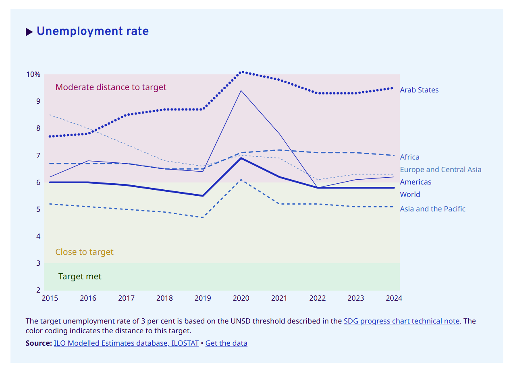

# Assessing the current state of the global labour market

**Data (data.world):** [https://data.world/makeovermonday/assessing-the-current-state-of-the-global-labour-market](https://data.world/makeovermonday/assessing-the-current-state-of-the-global-labour-market)

**Article / original viz:** [https://ilostat.ilo.org/blog/assessing-the-current-state-of-the-global-labour-market-implications-for-achieving-the-global-goals/](https://ilostat.ilo.org/blog/assessing-the-current-state-of-the-global-labour-market-implications-for-achieving-the-global-goals/)

**Original data source:** [https://ilostat.ilo.org/blog/assessing-the-current-state-of-the-global-labour-market-implications-for-achieving-the-global-goals/](https://ilostat.ilo.org/blog/assessing-the-current-state-of-the-global-labour-market-implications-for-achieving-the-global-goals/)

**Dataset:** `makeovermonday/assessing-the-current-state-of-the-global-labour-market`  
**Last updated on data.world:** 2025-04-25T05:20:37.452590249Z

---

Exploring the global unemployment rate across regions

---
{"editor":"simple"}
---
# **Original Visualization**

​

Datasource: [Assessing the current state of the global labour market: implications for achieving the Global Goals - ILOSTAT](https://ilostat.ilo.org/blog/assessing-the-current-state-of-the-global-labour-market-implications-for-achieving-the-global-goals/)

Article: [Assessing the current state of the global labour market: implications for achieving the Global Goals - ILOSTAT](https://ilostat.ilo.org/blog/assessing-the-current-state-of-the-global-labour-market-implications-for-achieving-the-global-goals/)