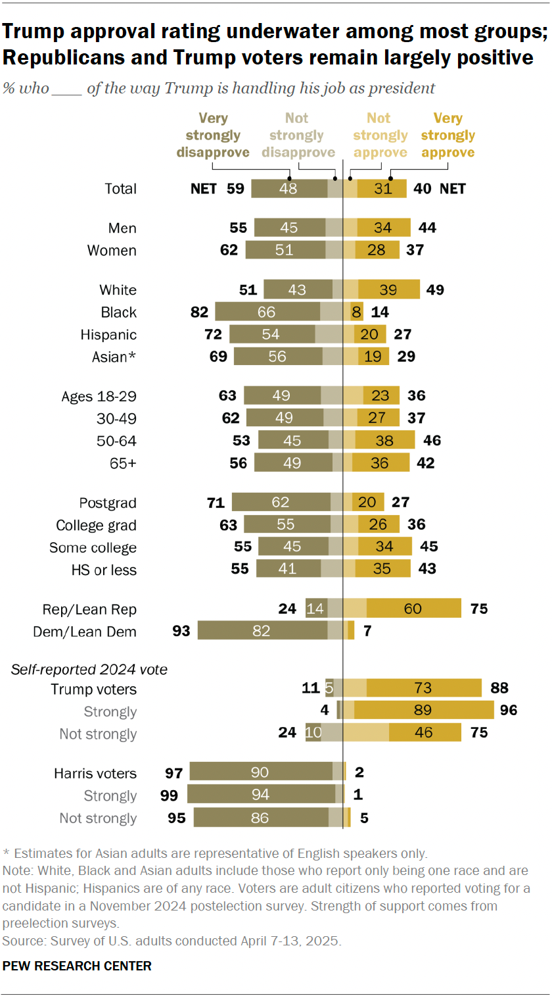

# 2025/W18 Trump Approval Ratings

**Data (data.world):** [https://data.world/makeovermonday/2025w18-trump-approval-ratings](https://data.world/makeovermonday/2025w18-trump-approval-ratings)

**Article / original viz:** [https://www.pewresearch.org/politics/2025/04/23/evaluations-of-trump-job-approval-and-confidence-on-issues/](https://www.pewresearch.org/politics/2025/04/23/evaluations-of-trump-job-approval-and-confidence-on-issues/)

**Original data source:** [https://www.pewresearch.org/politics/2025/04/23/trump-100-days-methodology/](https://www.pewresearch.org/politics/2025/04/23/trump-100-days-methodology/)

**Dataset:** `makeovermonday/2025w18-trump-approval-ratings`  
**Last updated on data.world:** 2025-04-27T21:19:47.925606939Z

---

% Who ____ of the way Trump is handling his job as president

---
{"editor":"simple"}
---
​

# **Original Visualization**

Datasource: [Pew Research Center](https://www.pewresearch.org/politics/2025/04/23/trump-100-days-methodology/)

Article: [Pew Research Center](https://www.pewresearch.org/politics/2025/04/23/evaluations-of-trump-job-approval-and-confidence-on-issues/)