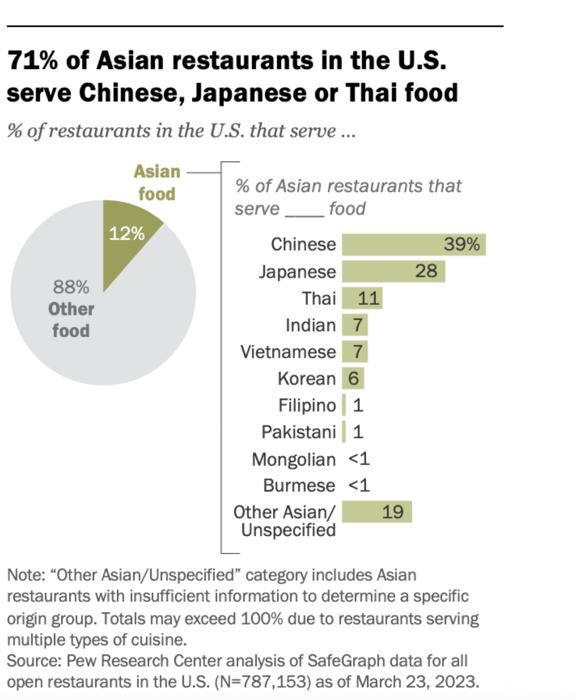

# 2025 W19: Asian Restaurants in the US

**Data (data.world):** [https://data.world/makeovermonday/2025-w19-asian-restaurants-in-the-us](https://data.world/makeovermonday/2025-w19-asian-restaurants-in-the-us)

**Article / original viz:** [https://www.pewresearch.org/short-reads/2023/05/23/71-of-asian-restaurants-in-the-u-s-serve-chinese-japanese-or-thai-food/](https://www.pewresearch.org/short-reads/2023/05/23/71-of-asian-restaurants-in-the-u-s-serve-chinese-japanese-or-thai-food/)

**Original data source:** [https://www.pewresearch.org/short-reads/2023/05/23/71-of-asian-restaurants-in-the-u-s-serve-chinese-japanese-or-thai-food/](https://www.pewresearch.org/short-reads/2023/05/23/71-of-asian-restaurants-in-the-u-s-serve-chinese-japanese-or-thai-food/)

**Dataset:** `makeovermonday/2025-w19-asian-restaurants-in-the-us`  
**Last updated on data.world:** 2025-05-04T21:03:00.925854181Z

---

---
{"editor":"simple"}
---
Source: Pew Research Center analysis of SafeGraph data for all
open restaurants in the U.S. (N=787,153) as of March 23, 2023.

Article: https://www.pewresearch.org/short-reads/2023/05/23/71-of-asian-restaurants-in-the-u-s-serve-chinese-japanese-or-thai-food/

​

