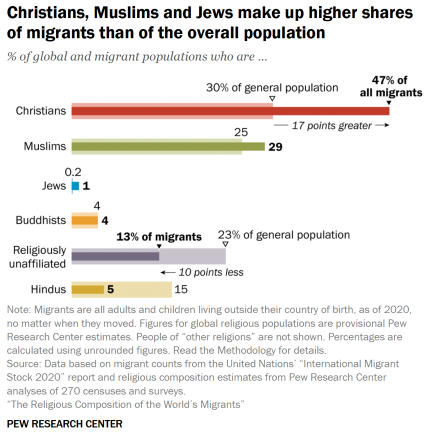

# 2025/W20 : The Religious Composition of the World’s Migrants

**Data (data.world):** [https://data.world/makeovermonday/2025w20-the-religious-composition-of-the-worlds-migrants](https://data.world/makeovermonday/2025w20-the-religious-composition-of-the-worlds-migrants)

**Article / original viz:** [https://www.pewresearch.org/religion/2024/08/19/the-religious-composition-of-the-worlds-migrants/](https://www.pewresearch.org/religion/2024/08/19/the-religious-composition-of-the-worlds-migrants/)

**Original data source:** [https://www.pewresearch.org/dataset/dataset-religious-composition-of-the-worlds-migrants-1990-2020/](https://www.pewresearch.org/dataset/dataset-religious-composition-of-the-worlds-migrants-1990-2020/)

**Dataset:** `makeovermonday/2025w20-the-religious-composition-of-the-worlds-migrants`  
**Last updated on data.world:** 2025-05-12T20:17:00.434928682Z

---

A breakdown of global migration patterns by religious affiliation

---
{"editor":"simple"}
---
# **Original Visualization**
​

​

Datasource: https://www.pewresearch.org/dataset/dataset-religious-composition-of-the-worlds-migrants-1990-2020/

Article: [How Immigrants Are Shaping the Religious Landscape | Pew Research Center](https://www.pewresearch.org/religion/2024/08/19/the-religious-composition-of-the-worlds-migrants/)