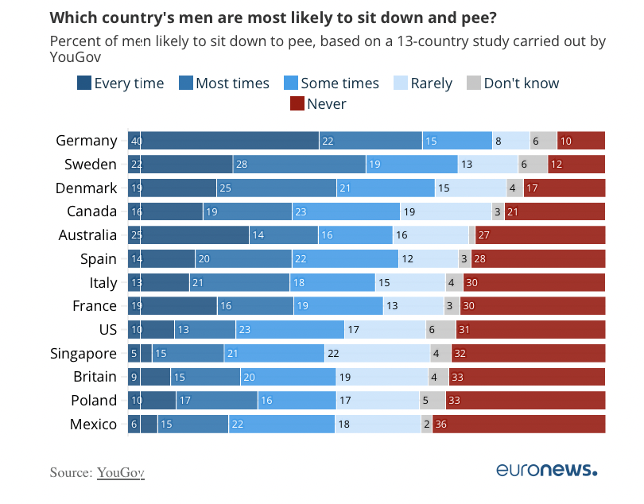

# 2025/w22  Where in Europe do men sit dow to pee?

**Data (data.world):** [https://data.world/makeovermonday/2025w22-where-in-europe-do-men-sit-dow-to-pee](https://data.world/makeovermonday/2025w22-where-in-europe-do-men-sit-dow-to-pee)

**Article / original viz:** [https://www.euronews.com/health/2023/05/18/sitzpinklers-where-in-europe-do-men-sit-down-or-stand-up-to-pee#:~:text=Source:%20YouGov,reflect%20in%20a%20quiet%20space](https://www.euronews.com/health/2023/05/18/sitzpinklers-where-in-europe-do-men-sit-down-or-stand-up-to-pee#:~:text=Source:%20YouGov,reflect%20in%20a%20quiet%20space)

**Original data source:** [https://yougov.co.uk/society/articles/45713-where-world-are-men-most-likely-sit-down-wee](https://yougov.co.uk/society/articles/45713-where-world-are-men-most-likely-sit-down-wee)

**Dataset:** `makeovermonday/2025w22-where-in-europe-do-men-sit-dow-to-pee`  
**Last updated on data.world:** 2025-05-25T21:34:11.119515607Z

---

Where in Europe do men sit dow to pee?

---
{"editor":"simple"}
---
Data source: You Gov

article:https://www.euronews.com/health/2023/05/18/sitzpinklers-where-in-europe-do-men-sit-down-or-stand-up-to-pee#:\~:text=Source:%20YouGov,reflect%20in%20a%20quiet%20space

​

