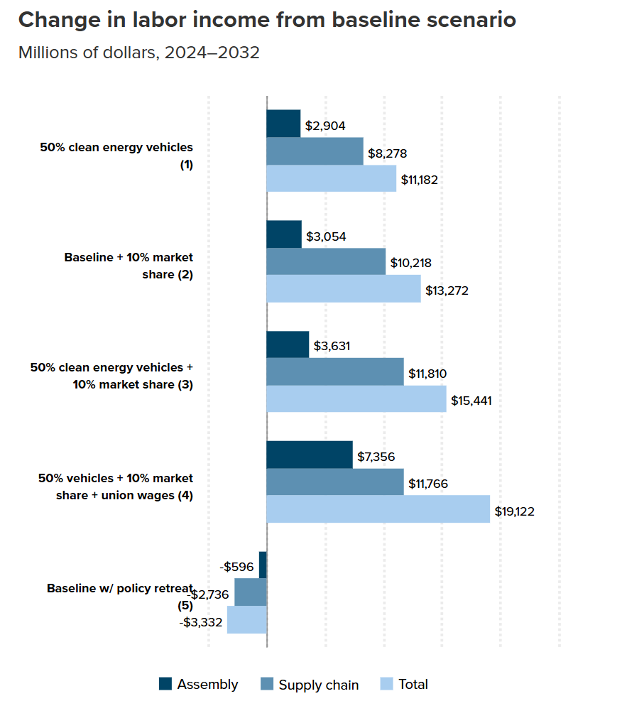

# What future will U.S. truck manufacturing have under Trump?

**Data (data.world):** [https://data.world/makeovermonday/what-future-will-us-truck-manufacturing-have-under-trump](https://data.world/makeovermonday/what-future-will-us-truck-manufacturing-have-under-trump)

**Article / original viz:** [https://www.epi.org/publication/future-clean-trucks-buses/](https://www.epi.org/publication/future-clean-trucks-buses/)

**Original data source:** [https://www.epi.org/publication/future-clean-trucks-buses/](https://www.epi.org/publication/future-clean-trucks-buses/)

**Dataset:** `makeovermonday/what-future-will-us-truck-manufacturing-have-under-trump`  
**Last updated on data.world:** 2025-06-02T04:28:23.773515074Z

---

Change in labor income from baseline scenario

---
{"editor":"simple"}
---
# **Original Visualization**

​

Datasource: [What future will U.S. truck manufacturing have under Trump? | Economic Policy Institute](https://www.epi.org/publication/future-clean-trucks-buses/)

Article: [What future will U.S. truck manufacturing have under Trump? | Economic Policy Institute](https://www.epi.org/publication/future-clean-trucks-buses/)

**Scenario explanations (Article excerpt)**

1. **50% clean truck and bus adoption**: The U.S. has joined a group of 36 nations pledging 100% of new sales will be clean trucks and buses by 2040.[53](https://www.epi.org/publication/future-clean-trucks-buses/#_note53) Given the rapidly converging cost differences and expected lower total cost of operation for clean energy vehicles, as well as private sector commitments to decarbonize and reduce operational costs, we consider an intermediate scenario where adoption of electrified trucks and buses may outpace S&P Global projections.[54](https://www.epi.org/publication/future-clean-trucks-buses/#_note54) Here, we assume that U.S. output of clean trucks and buses reaches 50% of the total by 2032—with increased production primarily coming from more BEVs—as opposed to the 28% for heavy-duty trucks and 42% for medium-duty trucks and buses currently predicted by S&P.
2. **Baseline + increased domestic market share**: Unlike the IRA’s Section 30D light-duty clean vehicle tax credits, clean commercial vehicles qualifying for up to $40,000 each under Section 45W do not come with the same requirements for North American assembly or for critical mineral and battery components. To test the potential impact of policies incentivizing increased domestic production of complete trucks and buses and parts, we assume a 10% increase in U.S. production with a doubling of U.S.-originating content in storage battery production.
3. **50% clean trucks and buses + increased domestic market share**: This scenario applies the assumption of increased domestic market share in the second scenario with the assumption of more rapid end-user clean vehicle adoption.
4. **Scenario 3 + widespread unionization.** As discussed above, policies supporting the development of clean energy truck and bus manufacturing industries eschewed requirements that public resources be used to support good jobs. Although political compromise necessary to pass legislation stripped motor vehicle manufacturing workers of labor protections extended to construction work, there are a variety of policy options available that can ensure public resources are being used to support good jobs and not just corporate profits. To test this scenario, we adjust total labor income in the truck and bus manufacturing industry to a union-equivalent rate, based on the current union-wage premium and industry unionization rate, while holding employment constant.
5. **Trump’s likely approach: retreat from the clean vehicle transition.** Despite the pressures from ballooning greenhouse gases and other toxic emissions from trucks and buses _and_ the rapid expansion of private investment into U.S. clean vehicle manufacturing, not a single Republican official supported IRA legislation. Now, many have pledged to undo public policies supporting this green transition—President Trump, Sen. John Barasso, Sen. Shelly Moore Capito, Rep. Cathy McMorris Rodgers—and at least nine Republican-sponsored bills would repeal or rescind IRA programs.[55](https://www.epi.org/publication/future-clean-trucks-buses/#_note55) In this scenario, we assume the loss of support for investment in domestic manufacturing cuts the domestic content shares of key clean vehicle components by as much as one-half, while loss of demand-side tax credits for MHDV purchases and declining production efficiencies at lower-scale operations cut U.S. clean vehicle production to one-fourth of the S&P Global baseline. Disruption and uncertainty from the policy reversal make consumers less likely to choose low- and no-emission powertrains over diesel trucks and buses, and those opting for clean vehicles are more likely to be supplied by foreign manufacturers or by domestic manufacturers using significantly higher foreign parts.