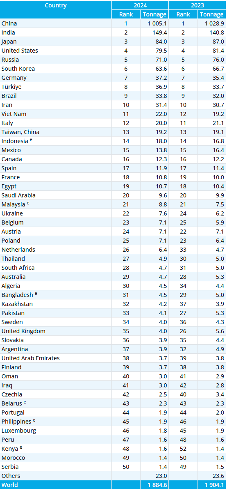

# 2025/W24 World Crude Steel Production

**Data (data.world):** [https://data.world/makeovermonday/2025w24-world-crude-steel-production](https://data.world/makeovermonday/2025w24-world-crude-steel-production)

**Article / original viz:** [https://worldsteel.org/data/world-steel-in-figures/world-steel-in-figures-2025/](https://worldsteel.org/data/world-steel-in-figures/world-steel-in-figures-2025/)

**Original data source:** [https://worldsteel.org/data/world-steel-in-figures/world-steel-in-figures-2025/](https://worldsteel.org/data/world-steel-in-figures/world-steel-in-figures-2025/)

**Dataset:** `makeovermonday/2025w24-world-crude-steel-production`  
**Last updated on data.world:** 2025-06-09T12:41:23.122707672Z

---

Major steel-producing countries 2023 and 2024. Measured in million tonnes for crude steel production.

---
{"editor":"simple"}
---
# **Original Visualization**

Datasource: [World Steel Association](https://worldsteel.org/data/world-steel-in-figures/world-steel-in-figures-2025/)

Article: [World Steel Association](https://worldsteel.org/data/world-steel-in-figures/world-steel-in-figures-2025/)