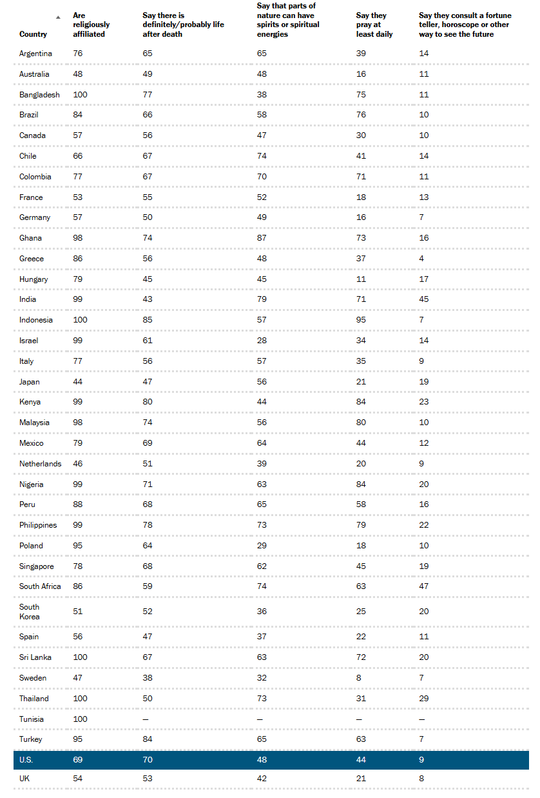

# 2025/W27 Spiritual & Religious Beliefs

**Data (data.world):** [https://data.world/makeovermonday/2025w27-spiritual-religious-beliefs](https://data.world/makeovermonday/2025w27-spiritual-religious-beliefs)

**Article / original viz:** [https://www.pewresearch.org/religion/2025/06/25/spirituality-and-religion-us-comparison-to-other-countries/#sortable-table](https://www.pewresearch.org/religion/2025/06/25/spirituality-and-religion-us-comparison-to-other-countries/#sortable-table)

**Original data source:** [https://www.pewresearch.org/religion/2025/06/25/spirituality-and-religion-us-comparison-to-other-countries/#sortable-table](https://www.pewresearch.org/religion/2025/06/25/spirituality-and-religion-us-comparison-to-other-countries/#sortable-table)

**Dataset:** `makeovermonday/2025w27-spiritual-religious-beliefs`  
**Last updated on data.world:** 2025-06-30T09:15:23.350850318Z

---

% of adults who have spiritual and religious beliefs. Surveyed across 2023 & 2024.

---
{"editor":"simple"}
---
# **Original Visualization**

Datasource: [Pew Research Center](https://www.pewresearch.org/religion/2025/06/25/spirituality-and-religion-us-comparison-to-other-countries/#sortable-table)

Article: [Pew Research Center](https://www.pewresearch.org/religion/2025/06/25/spirituality-and-religion-us-comparison-to-other-countries/#sortable-table)