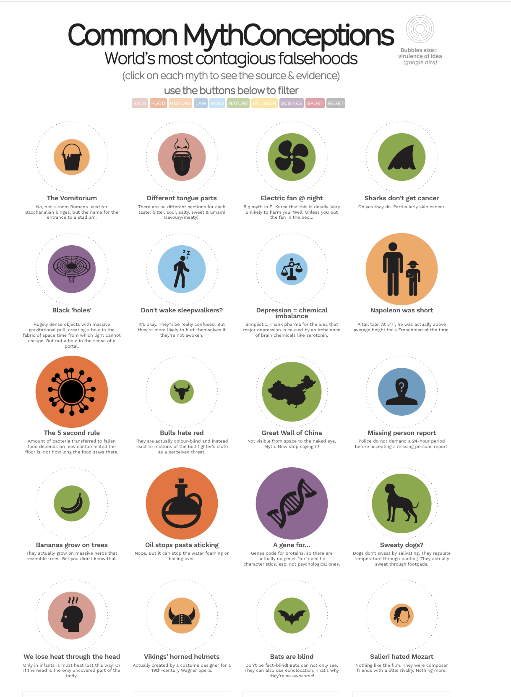

# 2025/week 28 common misconception

**Data (data.world):** [https://data.world/makeovermonday/2025week-28-common-misconception](https://data.world/makeovermonday/2025week-28-common-misconception)

**Article / original viz:** [https://informationisbeautiful.net/visualizations/common-mythconceptions/](https://informationisbeautiful.net/visualizations/common-mythconceptions/)

**Original data source:** [https://docs.google.com/spreadsheets/d/1A6ozupy4awmOBHbCQmemKjWOvo7yKgq5bWKuJ6T68pI/edit?gid=1#gid=1](https://docs.google.com/spreadsheets/d/1A6ozupy4awmOBHbCQmemKjWOvo7yKgq5bWKuJ6T68pI/edit?gid=1#gid=1)

**Dataset:** `makeovermonday/2025week-28-common-misconception`  
**Last updated on data.world:** 2025-07-07T09:13:33.276410022Z

---

---
{"editor":"simple"}
---

**Sources: **[Wikipedia](http://en.wikipedia.org/wiki/List_of_common_misconceptions,), NY Times, Straight Dope & Others.

**Credits: **Concept & Design: [David Mccandless](http://www.davidmccandless.com/)  Design: [Paulo Estriga](http://headaround.com/)  Additional Design: [Fabio Bergamaschi](http://www.fabiobergamaschi.com/), Tatjana Dubovina  Research: [Miriam Quick](https://twitter.com/miriamquick), [Ella Hollowood](https://twitter.com/ejhollowood), Pearl Doughty-White, [Dr Stephanie Starling](http://www.stephaniestarling.com/)  Code: [Omid Kashan](https://omid.uk/)  Rendered with: [VizSweet](http://www.vizsweet.com/) – dataviz software.