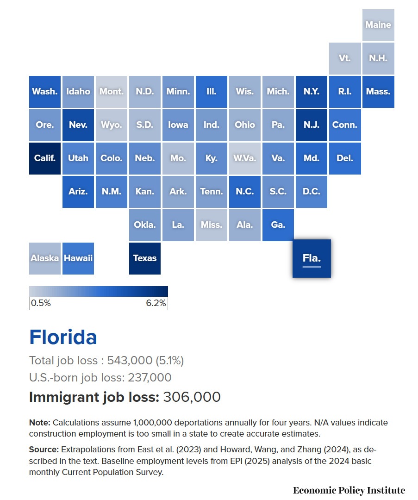

# 2025/WK 29 Trump's deportations will reduce employment

**Data (data.world):** [https://data.world/makeovermonday/2025wk-29-trumps-deportations-will-reduce-employment](https://data.world/makeovermonday/2025wk-29-trumps-deportations-will-reduce-employment)

**Article / original viz:** [https://www.epi.org/publication/trumps-deportation-agenda-will-destroy-millions-of-jobs-both-immigrants-and-u-s-born-workers-would-suffer-job-losses-particularly-in-construction-and-child-care/](https://www.epi.org/publication/trumps-deportation-agenda-will-destroy-millions-of-jobs-both-immigrants-and-u-s-born-workers-would-suffer-job-losses-particularly-in-construction-and-child-care/)

**Original data source:** [https://www.epi.org/publication/trumps-deportation-agenda-will-destroy-millions-of-jobs-both-immigrants-and-u-s-born-workers-would-suffer-job-losses-particularly-in-construction-and-child-care/](https://www.epi.org/publication/trumps-deportation-agenda-will-destroy-millions-of-jobs-both-immigrants-and-u-s-born-workers-would-suffer-job-losses-particularly-in-construction-and-child-care/)

**Dataset:** `makeovermonday/2025wk-29-trumps-deportations-will-reduce-employment`  
**Last updated on data.world:** 2025-07-14T16:22:17.732418374Z

---

---
{"editor":"simple"}
---
# **Original Visualization**

​

Datasource & Article :  [Trump’s deportation agenda will destroy millions of jobs: Both immigrants and U.S.-born workers would suffer job losses, particularly in construction and child care | Economic Policy Institute](https://www.epi.org/publication/trumps-deportation-agenda-will-destroy-millions-of-jobs-both-immigrants-and-u-s-born-workers-would-suffer-job-losses-particularly-in-construction-and-child-care/)