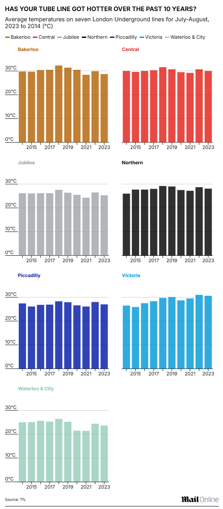

# 2025/W30 London Underground Average Monthly Temperatures

**Data (data.world):** [https://data.world/makeovermonday/2025w30-london-underground-average-monthly-temperatures](https://data.world/makeovermonday/2025w30-london-underground-average-monthly-temperatures)

**Article / original viz:** [https://www.dailymail.co.uk/sciencetech/article-13739705/london-underground-hottest-line.html](https://www.dailymail.co.uk/sciencetech/article-13739705/london-underground-hottest-line.html)

**Original data source:** [https://data.london.gov.uk/dataset/london-underground-average-monthly-temperatures/](https://data.london.gov.uk/dataset/london-underground-average-monthly-temperatures/)

**Dataset:** `makeovermonday/2025w30-london-underground-average-monthly-temperatures`  
**Last updated on data.world:** 2025-07-21T08:27:23.982164031Z

---

London Underground Average Monthly Temperatures (°C) 2013-2024

---
{"editor":"simple"}
---
# Original Visualization

Datasource: [TFL](https://data.london.gov.uk/dataset/london-underground-average-monthly-temperatures/)
Article: [Daily Mail](https://www.dailymail.co.uk/sciencetech/article-13739705/london-underground-hottest-line.html)