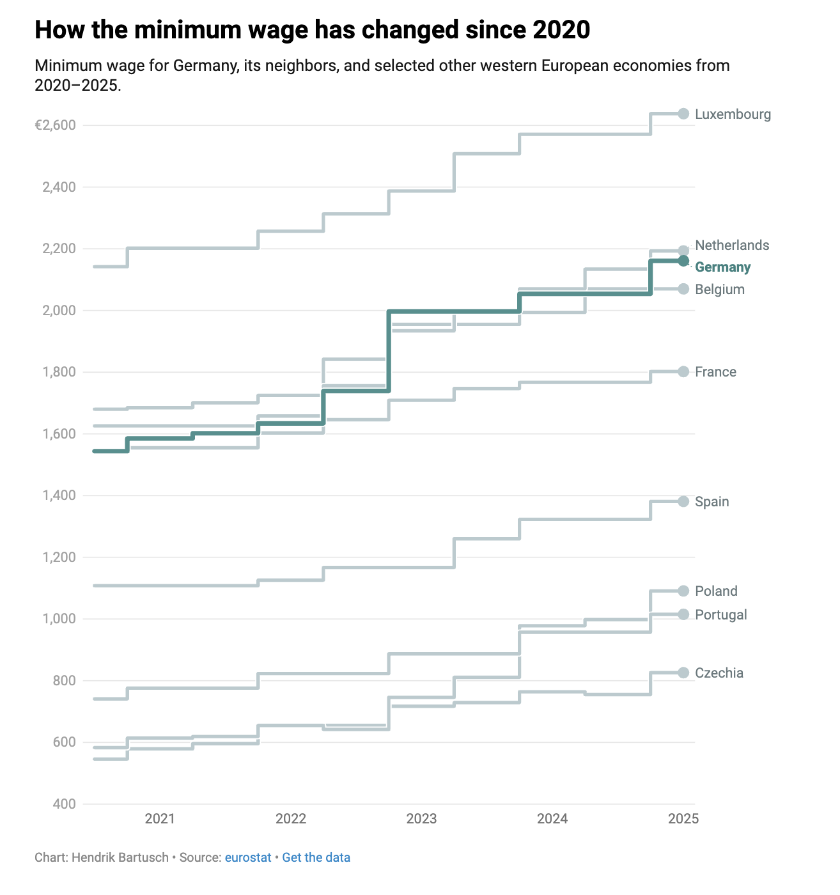

# 2025/ week 31/ Wages Across Europe

**Data (data.world):** [https://data.world/makeovermonday/2025-week-31-wages-across-europe](https://data.world/makeovermonday/2025-week-31-wages-across-europe)

**Article / original viz:** [https://www.datawrapper.de/blog/low-wages-europe](https://www.datawrapper.de/blog/low-wages-europe)

**Original data source:** [https://ec.europa.eu/eurostat/databrowser/explore/all/popul?lang=en&subtheme=labour.earn.earn_minw&display=list&sort=category&extractionId=earn_mw_cur](https://ec.europa.eu/eurostat/databrowser/explore/all/popul?lang=en&subtheme=labour.earn.earn_minw&display=list&sort=category&extractionId=earn_mw_cur)

**Dataset:** `makeovermonday/2025-week-31-wages-across-europe`  
**Last updated on data.world:** 2025-07-21T11:23:46.002260038Z

---

---
{"editor":"simple"}
---

Article: https://www.datawrapper.de/blog/low-wages-europe

Data from https://ec.europa.eu/eurostat/databrowser/explore/all/popul?lang=en&subtheme=labour.earn.earn\_minw&display=list&sort=category&extractionId=earn\_mw\_cur