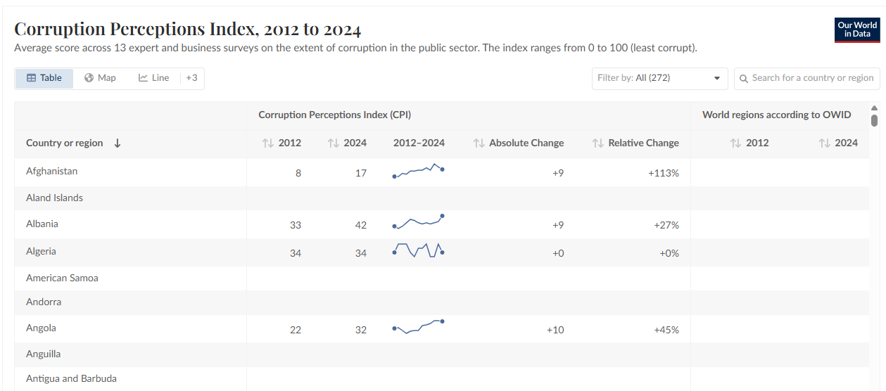

# 2025/W32 Corruption

**Data (data.world):** [https://data.world/makeovermonday/corruption](https://data.world/makeovermonday/corruption)

**Article / original viz:** [https://ourworldindata.org/corruption](https://ourworldindata.org/corruption)

**Original data source:** [https://ourworldindata.org/grapher/ti-corruption-perception-index?tab=table&time=earliest..2024&country=~NZL](https://ourworldindata.org/grapher/ti-corruption-perception-index?tab=table&time=earliest..2024&country=~NZL)

**Dataset:** `makeovermonday/corruption`  
**Last updated on data.world:** 2025-08-11T01:55:57.356324573Z

---

Corruption Perceptions Index, 2012 to 2024

---
{"editor":"simple"}
---
# **Original Visualization**

​

# **About this Dataset**
\* SOURCE: [Corruption - Our World in Data](https://ourworldindata.org/corruption)

# **Objectives**
\* What works and what doesn't work with this chart? \* How can you make it better? \* Share your remakes on Linkedin and/or Twitter!

Remember to tag Irene Diomi, Harry Beardon, and Chimdi Nwosu.